# Дипломная работа
*SIEM, ELK, syslog, auditd, Zabbix, Splunk*  

---

## Задачи:

### 1. **Изучаем на лабораторных стендах Splunk SIEM**
   - Лабораторная практика с SIEM системами.  

<details>
  <summary> Выполнение </summary>
  
1. Сначала я установила Docker на свою Ubuntu для развёртывания Splunk.  
   - Обновила системные пакеты:  
     `sudo apt update`
   - Установила Docker:  
     `sudo apt install docker.io -y`  
   - Включила Docker и добавила свой пользовательский аккаунт в группу docker:  
     ```
     sudo systemctl enable --now docker  
     sudo usermod -aG docker $USER
     ```
   - Перезагрузила систему, чтобы изменения вступили в силу.  

2. Скачала официальный образ Splunk из Docker Hub:  
   `docker pull splunk/splunk:latest`

   

3. Создала и запустила контейнер Splunk:  
   ```
   docker run -d --name splunk \
     -p 8000:8000 -p 8088:8088 -p 8089:8089 -p 9997:9997 \
     -e SPLUNK_START_ARGS="--accept-license" \
     -e SPLUNK_PASSWORD="StrongPassword123" \
     splunk/splunk:latest  
   ```
4. Проверила, что контейнер работает, с помощью команды:  
   `docker ps`

   

5. Перешла в браузер и открыла Splunk:  
   - В адресной строке ввела http://tms.ubuntu:8000  
   - Вошла в систему, используя логин admin и пароль StrongPassword123.  

   

6. Выполнила тестовый запрос в разделе Search & Reporting:  
   `index=_internal | stats count by sourcetype`
   - Изучила результаты поиска, в которых отобразилось количество событий по разным источникам.  

   

   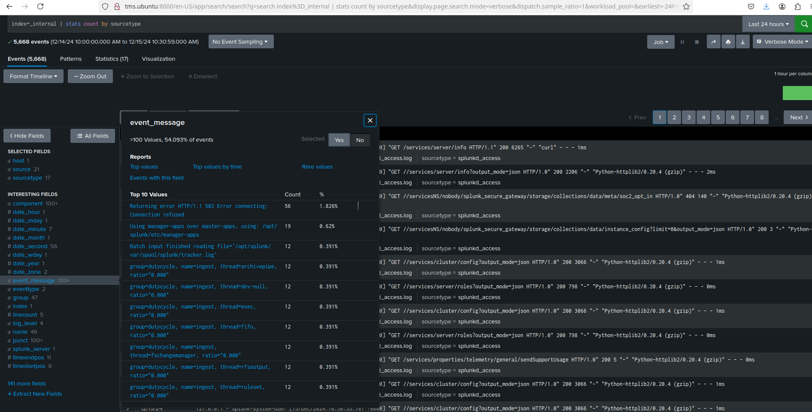

   


Разбор информации, представленной на скриншоте.

На изображении представлен фрагмент лога, предположительно из Splunk. Рассмотрим его структуру и значения ключевых полей.

Поля и их значения:

- **Дата и время**
   ```
   12/15/24 10:30:48.872 AM
   ```
   - Это метка времени (timestamp), которая указывает, когда событие было зафиксировано.
   - Формат: `MM/DD/YY HH:MM:SS.ms`.
   - Значение: `15 декабря 2024 года, 10:30:48.872`.

- **Код HTTP-ответа**
   ```
   code: 200
   ```
   - Это HTTP-статус код.
   - Значение `200` указывает, что запрос был успешно выполнен.

- **Длительность обработки**
   ```
   durationMS: 7.437
   ```
   - Длительность обработки запроса, измеряемая в миллисекундах (ms).
   - Значение: запрос обработан за 7.437 мс.

- **Ожидаемый код**
   ```
   expectedCode: 200
   ```
   - Это код ответа, который ожидался от выполнения операции.
   - Значение: система ожидала `200`, и именно такой код был получен.

- **Имя хоста**
   ```
   hostname: 5825b0d8180e
   ```
   - Указывает имя хоста, на котором была зафиксирована операция.
   - В данном случае это, вероятно, ID контейнера или машины, на которой работает Splunk.

- **Уровень логирования**
   ```
   level: INFO
   ```
   - Уровень логирования, который указывает серьёзность сообщения.
   - INFO: информационное сообщение, которое не указывает на ошибки или проблемы.

- **Местоположение в коде**
   ```
   location: splunkmgmtclient/client.go:186
   ```
   - Указывает на файл и строку исходного кода, где был вызван соответствующий лог.
   - Значение: в файле `splunkmgmtclient/client.go` на строке `186`.

- **Сообщение**
   ```
   message: request to splunk server succeeded
   ```
   - Человеко-читаемое сообщение, описывающее событие.
   - Значение: "Запрос к серверу Splunk был выполнен успешно".

- **Операция**
   ```
   operation: GetConfStanza
   ```
   - Указывает на конкретную операцию или вызов, связанный с событием.
   - Значение: `GetConfStanza` — вероятно, запрос на получение конфигурационного блока.

- **URL запроса**
    ```
    requestURL: https://127.0.0.1:8089/services/configs/conf-server/teleport_supervisor?output_mode=json
    ```
    - Указывает URL, который был запрошен.
    - Значение: запрос был выполнен к локальному серверу (127.0.0.1) на порту `8089`.
    - Путь `services/configs/conf-server/teleport_supervisor` предполагает, что система запрашивает конфигурацию сервера `teleport_supervisor` в формате JSON.

- **Сервис**
    ```
    service: identity
    ```
    - Указывает на имя сервиса, связанного с данным запросом.
    - Значение: `identity` — возможно, компонент системы управления идентификацией.

- **Полная временная метка**
    ```
    time: 2024-12-15T10:30:48.872Z
    ```
    - Полная временная метка в формате ISO 8601 (UTC).
    - Указывает точное время события.

- **Дополнительные данные**
    ```
    host: 5825b0d8180e
    source: /opt/splunk/var/log/splunk/sup-pkg-identity-stdout.log
    sourcetype: sup-pkg-identity-stdout-too_small
    ```
    - **host**: Имя или идентификатор хоста, который сгенерировал лог.
    - **source**: Путь к лог-файлу, в котором зафиксировано событие (`/opt/splunk/var/log/splunk/sup-pkg-identity-stdout.log`).
    - **sourcetype**: Тип источника, определяющий структуру данных (`sup-pkg-identity-stdout-too_small`).

Интерпретация:

- Лог описывает успешный HTTP-запрос к локальному серверу Splunk (127.0.0.1), который запрашивает конфигурацию сервиса `teleport_supervisor`.
- Запрос завершился успешно с HTTP-ответом `200` за 7.437 мс.
- Лог создан на сервере с именем (или ID) `5825b0d8180e`, а данные зафиксированы в лог-файле `/opt/splunk/var/log/splunk/sup-pkg-identity-stdout.log`.
- Уровень логирования `INFO` означает, что событие носит чисто информационный характер и не является ошибкой.


7. Создала дашборд для визуализации данных:  
   - Составила запрос:  
     `index=_internal | stats count by sourcetype`
   - Настроила графики и сохранила дашборд.  

   


---

</details>

### 2. **Установка ELK стэка с помощью docker-compose**
   - Установка ELK.  

<details>
  <summary> Выполнение </summary>
  
1. Установила docker-compose на свою Ubuntu:  
   `sudo apt install docker-compose -y`  

2. Создала файл docker-compose.yml для установки ELK:  
```
version: '3.7'
services:
  elasticsearch:
    image: docker.elastic.co/elasticsearch/elasticsearch:7.17.4
    container_name: elasticsearch
    environment:
      - discovery.type=single-node
    ports:
      - "9200:9200"
      - "9300:9300"
    volumes:
      - esdata:/usr/share/elasticsearch/data

  kibana:
    image: docker.elastic.co/kibana/kibana:7.17.4
    container_name: kibana
    environment:
      ELASTICSEARCH_HOSTS: http://elasticsearch:9200
    ports:
      - "5601:5601"

  fluentd:
    build:
      context: .
      dockerfile: Dockerfile
    container_name: fluentd
    ports:
      - "9880:9880" # HTTP порт для входящих данных
      - "9880:9880/udp"
    volumes:
      - ./fluentd.conf:/fluentd/etc/fluent.conf
      - fluentd-storage:/fluentd/log
    environment:
      FLUENT_ELASTICSEARCH_HOST: elasticsearch
      FLUENTD_LOG_LEVEL: debug

volumes:
  esdata:
  fluentd-storage:


```

и `Dockerfile` там же, где docker-compose.yml

```
FROM fluent/fluentd:v1.15-1
USER root

# Устанавливаем curl
RUN apk add --no-cache curl

# Устанавливаем плагин для работы с Elasticsearch
RUN gem install fluent-plugin-elasticsearch --no-document

USER fluent

```

3. Настроила Fluentd с помощью файла fluentd.conf:  
```
<source>
  @type http
  port 9880
  bind 0.0.0.0
</source>

<match **>
  @type elasticsearch
  host elasticsearch
  port 9200
  logstash_format true
</match>

```

4. Запустила EFK-стэк:  
```
   docker-compose build
   docker-compose up -d
```

   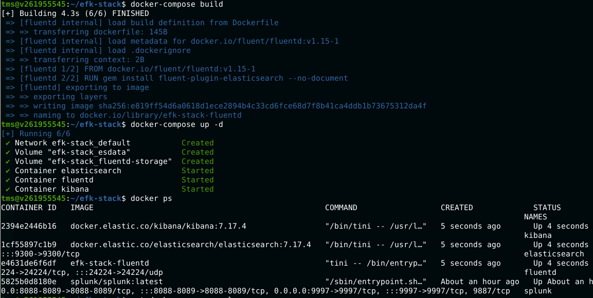


5. Проверила доступность Kibana, перейдя по адресу http://tms.ubuntu:5601  
   - Убедилась, что Kibana подключена к Elasticsearch и отображает данные.

   

6. Отправила тестовые логи через Fluentd и убедилась, что они отображаются в Kibana.
   `curl -X POST -H "Content-Type: application/json" -d '{"message": "Hello via HTTP"}' http://localhost:9880/my_tag?json`

   


Если что-то шло не так, и нужно полностью всё пересобрать с другой конфигурацией, то делала вот так:

```
   docker-compose down --volumes --rmi all
   docker-compose build
   docker-compose up -d
```

---

</details>

### 3. **Установка SIEM Wazuh с помощью docker-compose**
   - Установка Wazuh docker-compose.  

<details>
  <summary> Выполнение </summary>
  
1. Клонировала репозиторий Wazuh, выбрала стабильную версию и сгенерировала сертификаты:  
```
   sudo apt update && sudo apt upgrade -y
   sudo apt install -y apt-transport-https ca-certificates curl software-properties-common
   curl -fsSL https://download.docker.com/linux/ubuntu/gpg | sudo gpg --dearmor -o /usr/share/keyrings/docker-archive-keyring.gpg
   echo "deb [arch=amd64 signed-by=/usr/share/keyrings/docker-archive-keyring.gpg] https://download.docker.com/linux/ubuntu $(lsb_release -cs) stable" | sudo tee /etc/apt/sources.list.d/docker.list > /dev/null
   sudo apt install -y docker-ce docker-compose-plugin -y
   git clone https://github.com/wazuh/wazuh-docker.git  
   cd wazuh-docker
   git checkout v4.9.2
   cd single-node
   docker compose -f generate-indexer-certs.yml run --rm generator
```

2. Запустила Wazuh:  
   `docker compose up -d`

   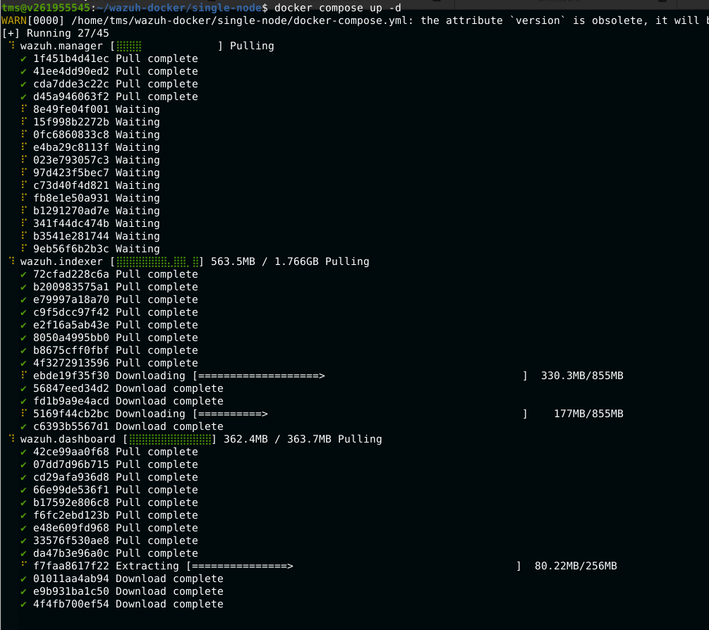

   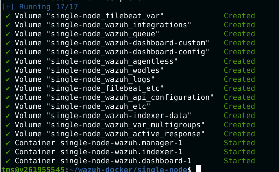


3. Перешла в интерфейс Wazuh через браузер, используя https://tms.ubuntu
   - Авторизовалась с логином kibanaserver и паролем kibanaserver (в docker-compose.yml указаны).

   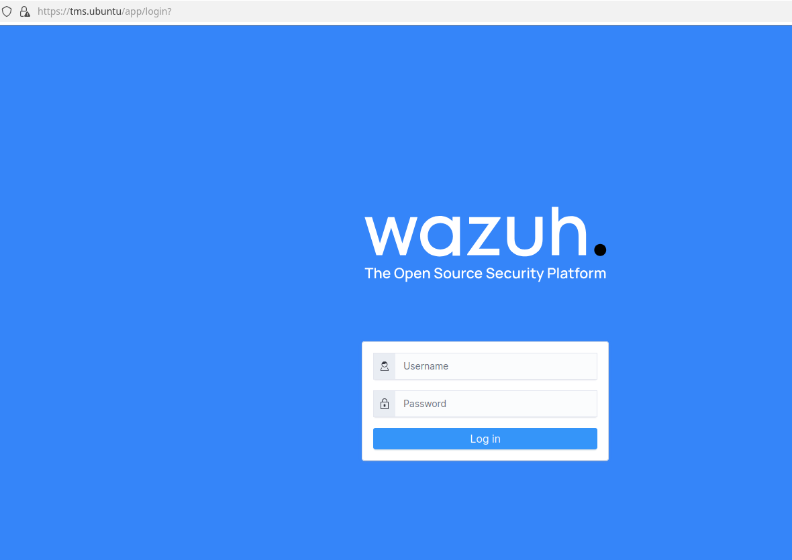

   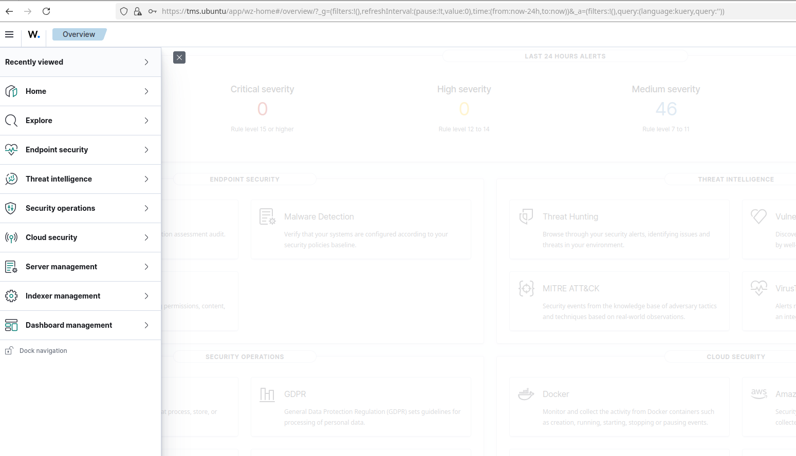


4. Установила агент Wazuh на тестовую систему, чтобы собирать логи:  
```
   curl -O https://packages.wazuh.com/4.x/apt/pool/main/w/wazuh-agent/wazuh-agent_4.9.2-1_amd64.deb
   sudo dpkg -i wazuh-agent_4.9.2-1_amd64.deb
```

   - В `/var/ossec/etc/ossec.conf` прописала IP-адрес сервера Wazuh (в данном случае 127.0.0.1, т.к. агента ставила на тот же сервер)
   - Зарегистрировала агента и проверила
```
   sudo /var/ossec/bin/agent-auth -m 127.0.0.1
```

   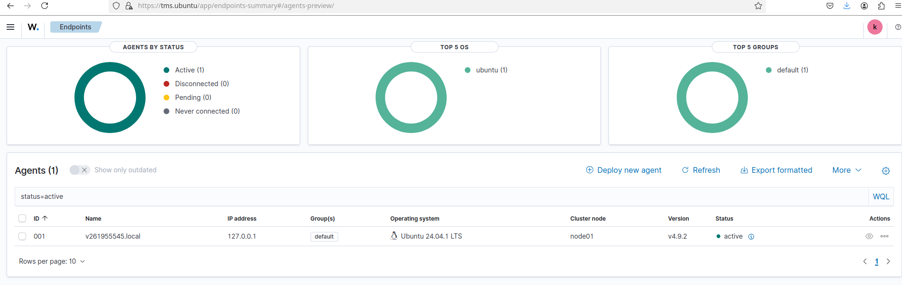

   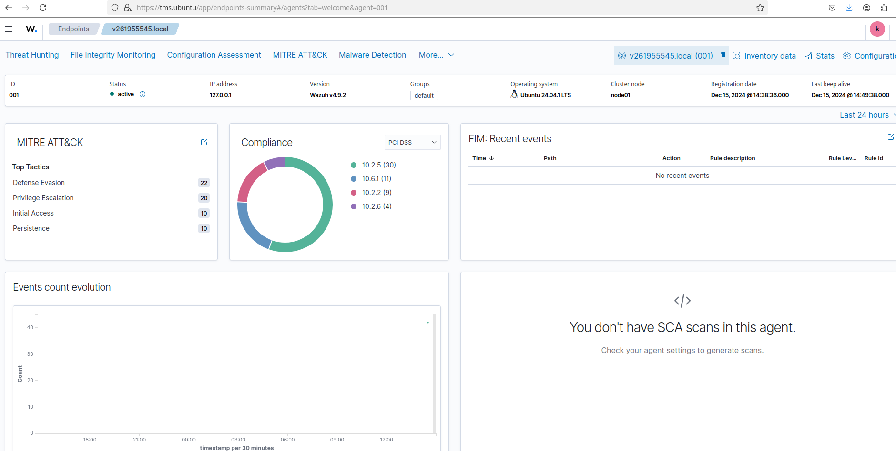

   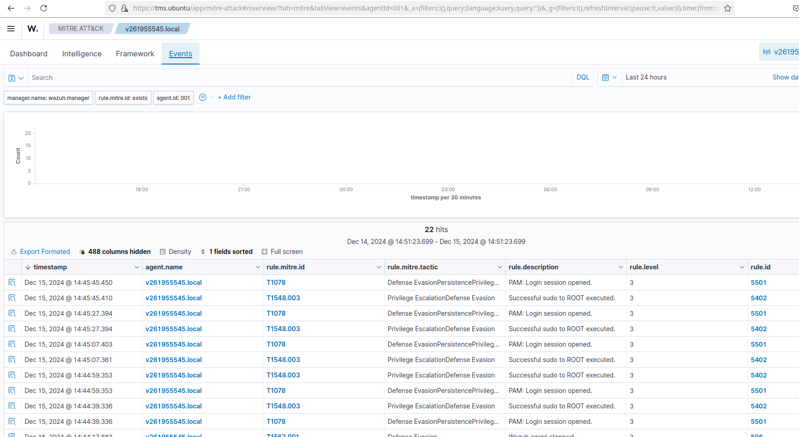

5. Установила агент на Windows

Взяла инструкцию по установке [отсюда](https://documentation.wazuh.com/current/installation-guide/wazuh-agent/wazuh-agent-package-windows.html)

Выбрала путь GUI для установки агента на Windows:

   


Далее на Ubuntu зарегистрировала агента и получила ключ для него:

   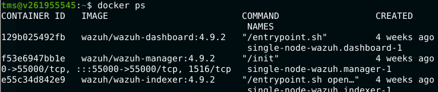

   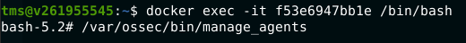

   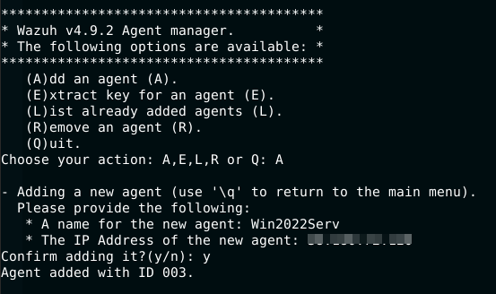

   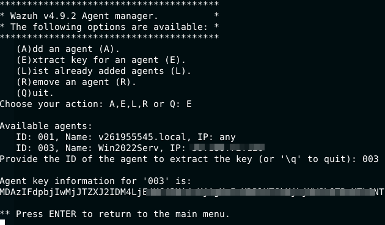

Активировала агента на Win-хосте:

   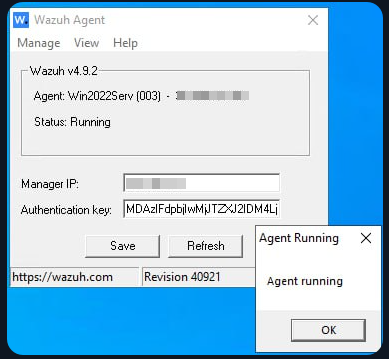

И зарегистрировала в wazuh:

   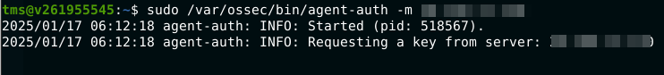

Проверяем, что агент виден и всё читается:

   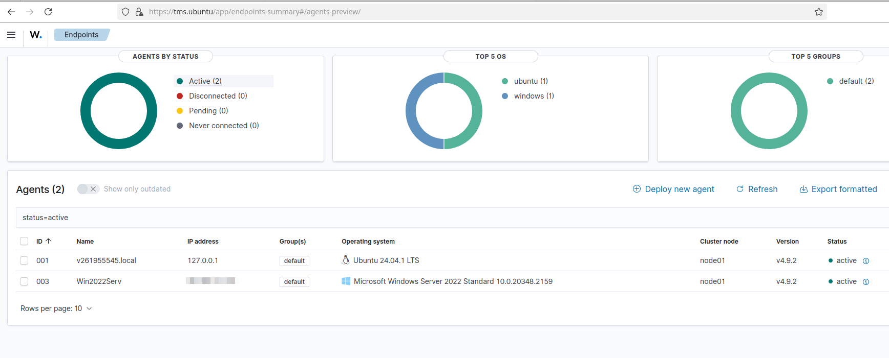

   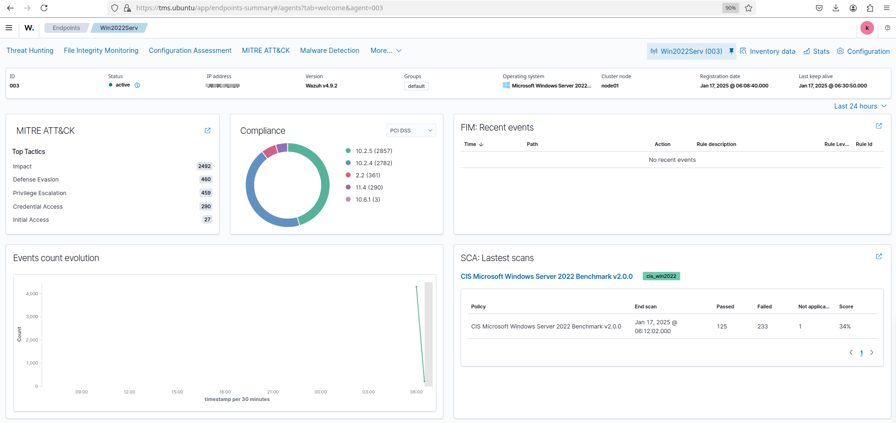

   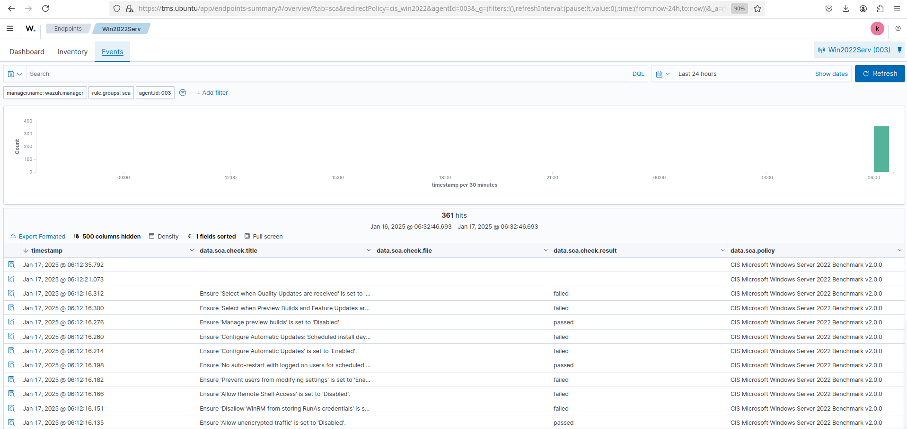


</details>

---

## Дополнения к дипломной работе

<details>
  <summary> Теория и обоснование проекта </summary>

## Определения и обоснование проекта

### Информационная безопасность (IB)
Информационная безопасность — это состояние защищенности информации, обеспечивающее ее конфиденциальность, целостность и доступность. Эти аспекты часто называют "CIA-триадой" (от англ. Confidentiality, Integrity, Availability).

### Зачем нужно обеспечивать IB
1. **Защита данных:** Любая утечка данных (коммерческих, личных или секретных) может привести к финансовым и репутационным потерям.  
2. **Защита оборудования и сетей:** Кибератаки могут повредить сетевое оборудование, повышая риск простоя.  
3. **Соблюдение законодательства:** Для многих организаций есть законодательные обязательства по защите данных (например, GDPR, HIPAA).

### Ключевые элементы системы защиты информации
1. **SIEM (Системы управления событиями информационной безопасности):**  
   Платформа, которая собирает и анализирует логи из различных систем и оборудования, обнаруживая возможные угрозы или аномалии.  
2. **Мониторинг логов (аудит):**  
   Это обеспечивает прозрачность работы сети и принятие оперативных решений в случае инцидентов.  

---

## Продукты, настраиваемые в проекте

### 1. Wazuh (как SIEM)
- **Зачем нужен:** Wazuh предоставляет функционал для мониторинга и анализа логов всех устройств в сети. Это помогает вовремя выявлять угрозы, обеспечивать соблюдение комплайнса и минимизировать риски.  

### 2. Агент Wazuh для Windows и Linux
- **Зачем нужен:** Агенты собирают логи с устройств и отправляют их в сервер Wazuh, где происходит их обработка и анализ.  

### 3. Auditd для Linux
- **Зачем нужен:** Auditd создает подробные логи о действиях в системе Linux, которые помогают идентифицировать несанкционированные изменения или подозрительные активности. Это повышает уровень детализации и прозрачности в мониторинге.  

### 4. Elastic Stack (ELK)
- **Зачем нужен:** Включает Elasticsearch, Logstash и Kibana. Эти компоненты работают вместе с Wazuh, предоставляя мощные инструменты для визуализации данных и углубленного анализа логов.  

---

## Как это все работает вместе
1. Агенты (Wazuh и Auditd) собирают логи и передают их на сервер Wazuh.  
2. Wazuh анализирует данные, выявляет угрозы и передает результаты в Elastic Stack для визуализации.  
3. SIEM-система (Wazuh) предоставляет уведомления и отчеты о событиях, помогая оперативно реагировать на инциденты.  

Эта интеграция позволяет в реальном времени следить за безопасностью корпоративной сети, выявлять уязвимости и быстро реагировать на возникающие угрозы.
</details>
