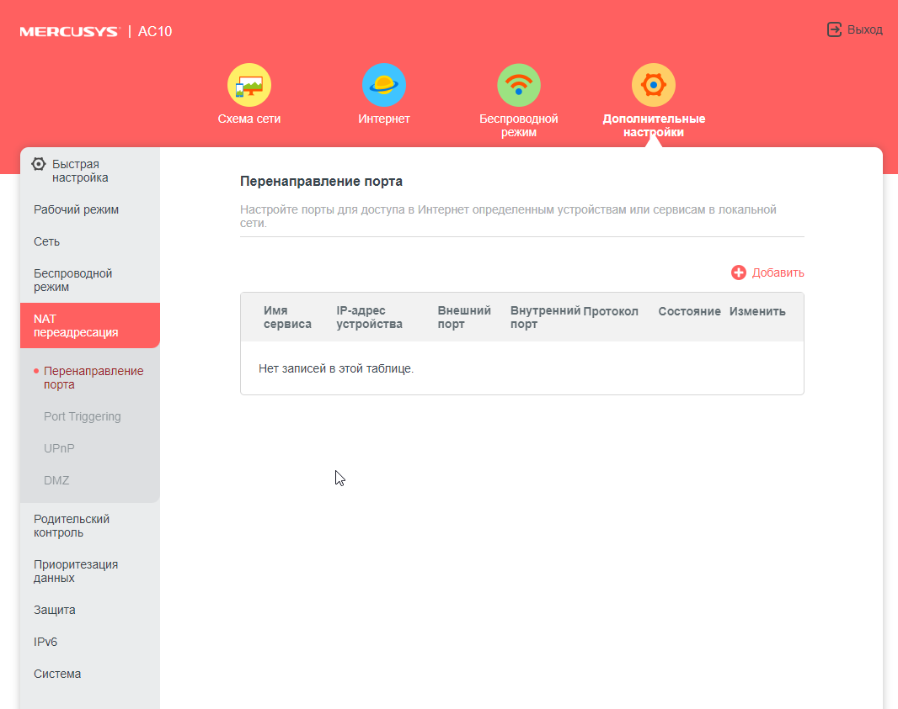
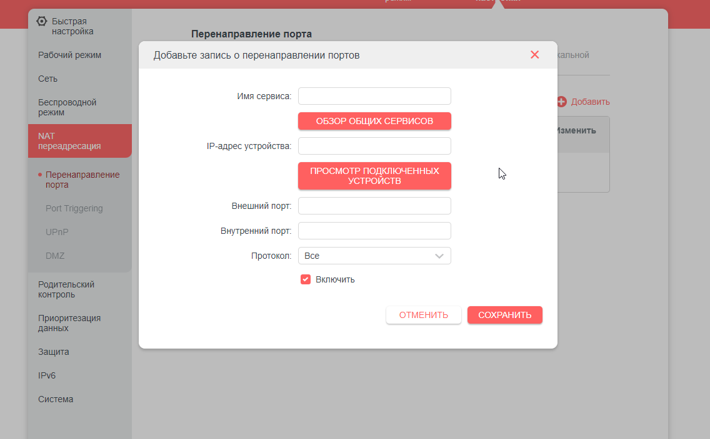
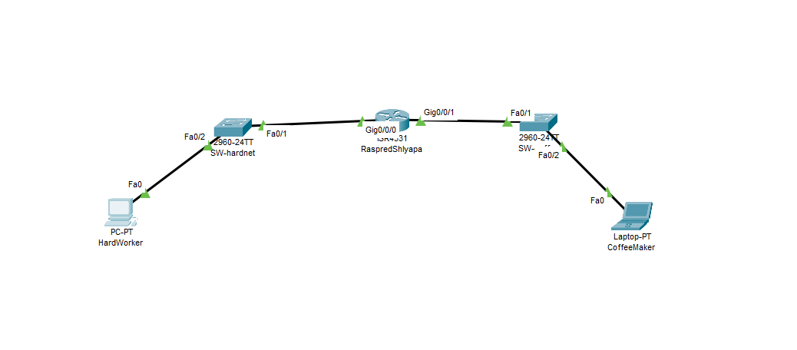
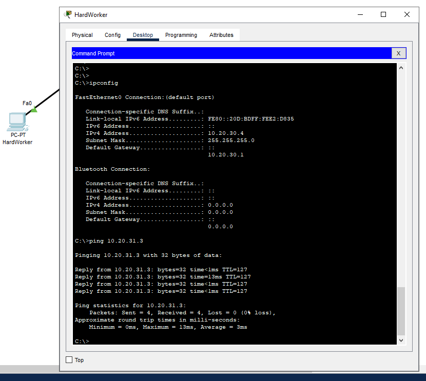
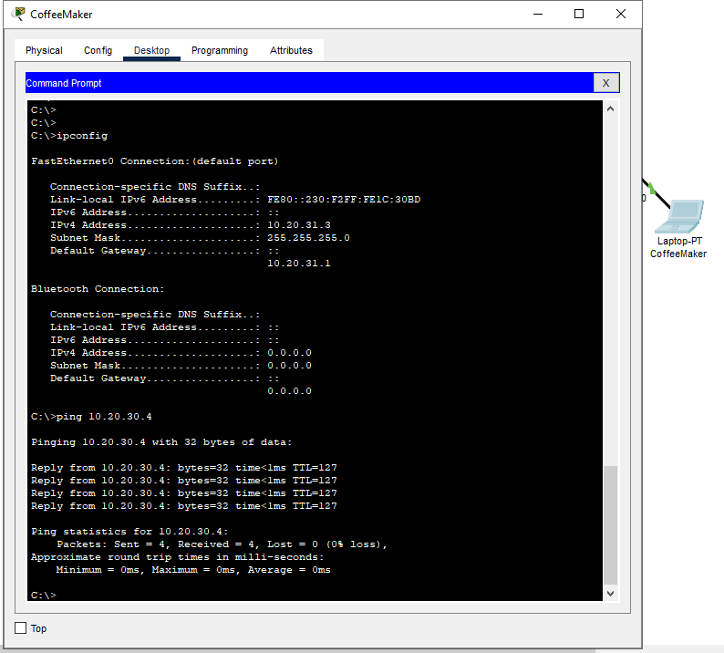
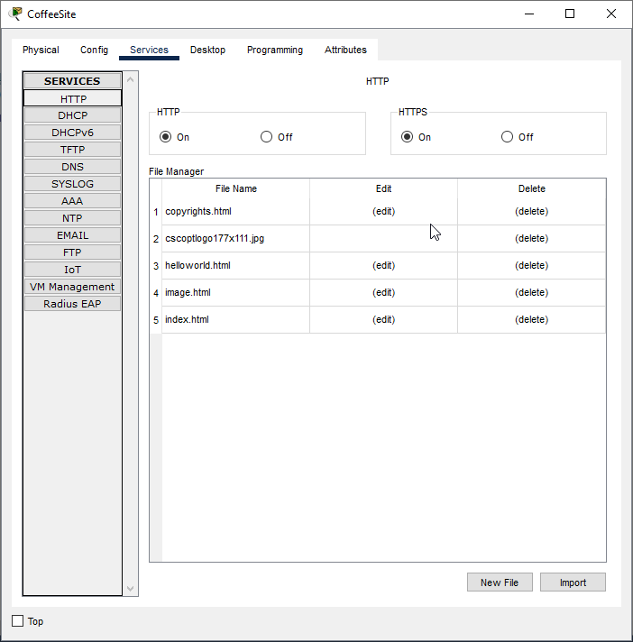
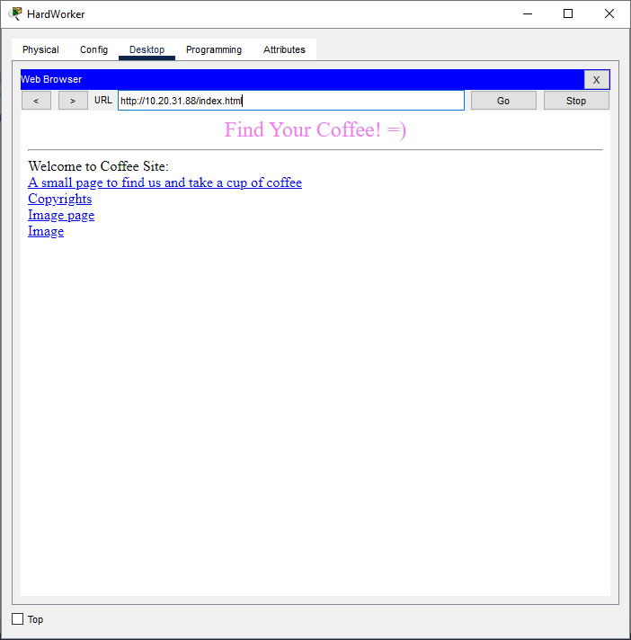

# Домашняя работа №5

## Сети, маршрутизация. Часть 2<br>
DNS, DHCP, WAN, LAN, VLAN, Cisco Packet tracer


### 1. Изучить конфигурацию роутера:
  - Зайти в настройки домашнего роутера
  - Изучить настройки, сделать скрины настройки проброса портов приложений (на примере если бы вы хотели открыть доступ к домашнему веб-серверу)

<br>
<br>
<br>


### 2. Работа с Cisco Packet Tracer:
  - Собрать базовую схему комп-свитч-роутер-свитч-комп
  - Сегментировать сеть на 10 и 20 vlan, добиться видимости хостов
  - Настроить сеть, добиться echo ping запросов между хостами
  - Проследить на симуляции за пакетом ICMP

Вот моя схема:<br>
<br>
- На PC HardWorker поднят IP 10.20.30.4/24 gw 10.20.30.1
- На свитче hardnet на 1 и 2 порту включен 10 влан
- На роутере RaspredShlyapa на 0 порту поднят 10.20.30.1/24, на 1 порту 10.20.31.1/24, роуты добавлены такие:<br>
    ```ip route 10.20.30.0 255.255.255.0 10.20.30.1```<br>
    ```ip route 10.20.31.0 255.255.255.0 10.20.31.1```<br>
    также был включён роутинг (ip rounting), чтобы VLAN'ы друг друга видели<br>
- На свитче Coffee на активных портах (1 и 2) включен 20 влан
- На ноуте CoffeeMaker поднят IP 10.20.31.3/24 gw 10.20.31.1

Машины друг друга видят:<br>
<br>
<br>

*На 1 из сторон заменить хост на сервер, настроить на сервере web страничку, настроить NAT на роутере, добиться доступа по NAT inside global адресу к web серверу 

На сервере (10.20.31.88) включила службу HTTP (точнее, она уже там итак была включена)<br>
<br>
Подправила файл index.html, открыла ссылку http://10.20.31.88/index.html на компе HardWorker (10.20.30.4)<br>
<br>

### Ссылки на дополнительные ресурсы
  [Настройка DNS Windows server 2019](https://ispserver.ru/help/nastroyka-sobstvennogo-servera-imen-windows-server)<br>
  [Как работает NAT](https://moxa.pro/blogs/articles/chto-takoe-nat-osobennosti-v-moxa#:~:text=%D0%A4%D1%83%D0%BD%D0%BA%D1%86%D0%B8%D1%8F%20NAT%20%D0%BF%D1%80%D0%B5%D0%BE%D0%B1%D1%80%D0%B0%D0%B7%D0%BE%D0%B2%D1%8B%D0%B2%D0%B0%D0%B5%D1%82%20%D0%B2%D0%BD%D1%83%D1%82%D1%80%D0%B5%D0%BD%D0%BD%D0%B8%D0%B9%20IP,%D0%BD%D0%BE%D0%BC%D0%B5%D1%80%20%D0%BF%D0%BE%D1%80%D1%82%D0%B0%2C%20%D0%BA%D0%BE%D1%82%D0%BE%D1%80%D1%8B%D0%B9%20%D0%B8%D1%81%D0%BF%D0%BE%D0%BB%D1%8C%D0%B7%D1%83%D0%B5%D1%82%20%D1%83%D1%81%D1%82%D1%80%D0%BE%D0%B9%D1%81%D1%82%D0%B2%D0%BE.)<br>
  [CIS C0ntrol 8.1](https://service.securitm.ru/docs/cis-csc-8)<br>
  [IPv6 vs IPv4](https://community.fs.com/ru/article/ipv4-vs-ipv6-whats-the-difference.html)
