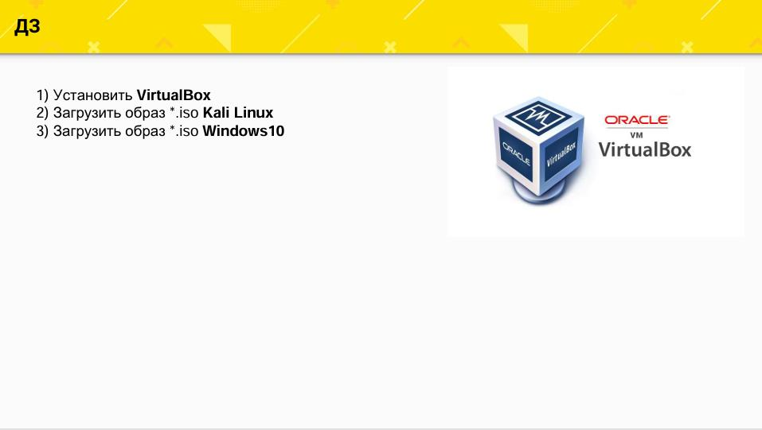
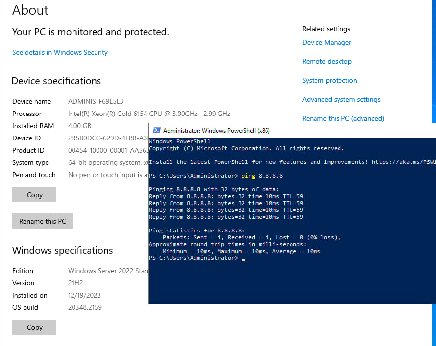

# Домашнее задание №1



По техническим причинам не имею возможности держать VirtualBox с тремя виртуальными машинами.
<br>Поэтому решением стали 3 VPS (Virtual Private Server) у хостера:


VPS с Kali на ноде с KVM (не стала иксы поднимать).
<br>**Ресурсы:**
```3 vcpu, 40 Gb HDD, 4 Gb RAM```<br>


VPS с Windows server 2022
<br>**Ресурсы:**
```6 vcpu, 40 Gb HDD, 4 Gb RAM```<br>


VPS с Windows 10 Pro
<br>**Ресурсы:**
```4 vcpu, 40 Gb HDD, 4 Gb RAM```<br>


Сеть везде есть, т.е. VPS друг друга видят. Ресурсы можно добавлять.<br>
Суть задания достигнута.
