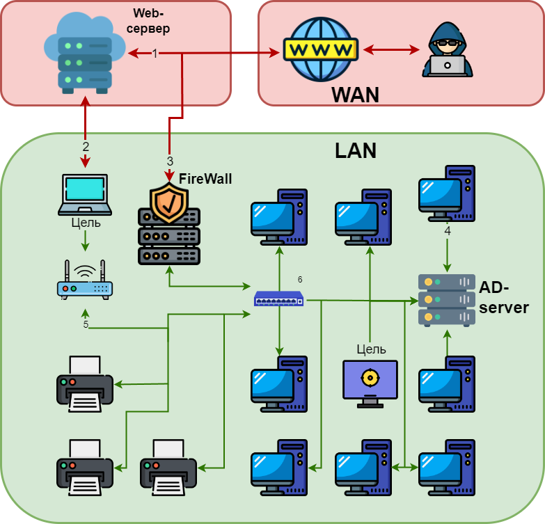

# Домашняя работа №10 + №11
## Mittre Att&ck / Re&ct / D3fence

### 1. Вы – хакер, находящийся в интернете, вам необходимо проникнуть внутрь инфраструктуры и скомпрометировать 2 цели, применяя матрицу Att&ck:
    1-ая - компьютер глав. буха компании
    2-ая - ноутбук системного администратора 

Выполнение:

А ещё в процессе...

### 2. Разработать план защиты и план реагирования на атаку, которую вы провели гипотетически в предыдущем задании. Используя матрицы D3fence и Re&ct:
_p.s. У вас есть базы данных, AD DC, Cisco ASA, FTP / NFC servers, Wi-Fi routers, Web server ISS/ Nginx, внешние и внутренние ресурсы_

Выполнение:

А ещё в процессе...

### Ссылки на дополнительные ресурсы
[Mittre ATT&CK Navigator](https://mitre-attack.github.io/attack-navigator/) 
[Mittre ATT&CK](https://attack.mitre.org/) 
[https://roadmap.sh/cyber-security](https://roadmap.sh/cyber-security) 
[Mittre ATT$CK defend](https://d3fend.mitre.org) 
[React Matrix](https://atc-project.github.io/react-navigator/) 
[APT Groups and Operations](https://docs.google.com/spreadsheets/d/1H9_xaxQHpWaa4O_Son4Gx0YOIzlcBWMsdvePFX68EKU/edit?pli=1&gid=1636225066#gid=1636225066)
