# Домашняя работа № 13
## Безопасность Windows OS

### 1. Сделать все ДЗ до 13 занятия!:)
 ✔️
### 3. Установить виртуальную машину Windows server 2019
 - Выполнить все пункты настройки windows согласно пунктов на [страницах слайда 13 занятия](13_Windows.pdf) №22-29

<details>
  <summary> Выполнение </summary>

У меня Windows 2022 Server.

#### 💻🔮👾 Создание учётной записи (УЗ) с правами администратора

(**пароль должен быть не менее 10 символов и содержать спец. символы и цифры!**)
<br>

```powershell
$Username = "Adminotest"
$Password = "P@ssV0rt142!"
$SecurePassword = ConvertTo-SecureString $Password -AsPlainText -Force
New-LocalUser -Name $Username -Password $SecurePassword -FullName "Administrator Account" -Description "Local Admin"
Add-LocalGroupMember -Group "Administrators" -Member $Username
```
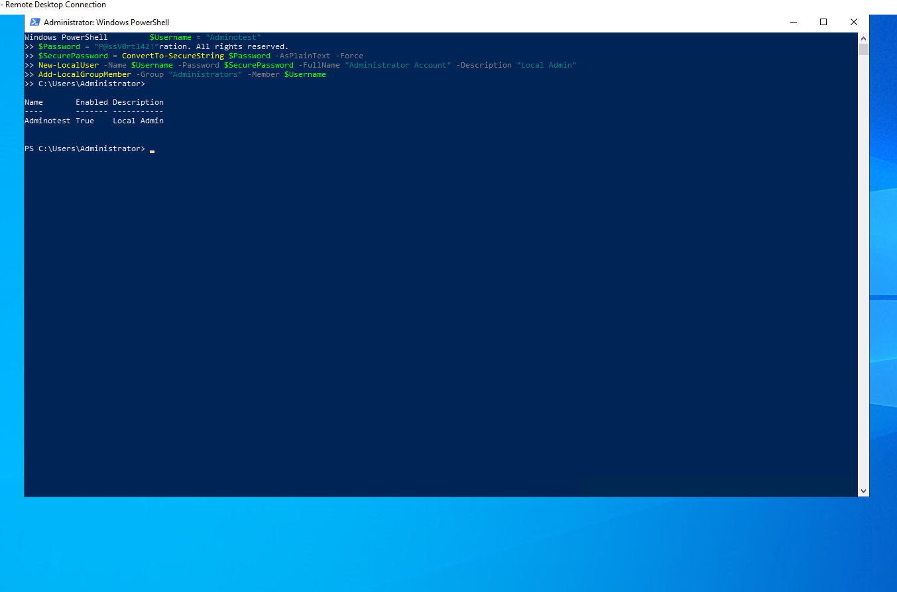

#### 💻🔮👾 Создание УЗ без административных прав для сотрудника:

- для УЗ задать имя как указано в домене (пример: Ivan.Ivanov).
- при создании оставить включенной опцию "Требовать смены пароля при следующем входе в систему"
```powershell
$UserName = "Aleks.Shel"
$Password = "SomeP@ssV0rt!"
$SecurePassword = ConvertTo-SecureString $Password -AsPlainText -Force
New-LocalUser -Name $UserName -Password $SecurePassword -FullName "Aleks Shel" -Description "Standard User"
Set-LocalUser -Name $UserName -PasswordNeverExpires $false
net user Aleks.Shel /logonpasswordchg:yes
```
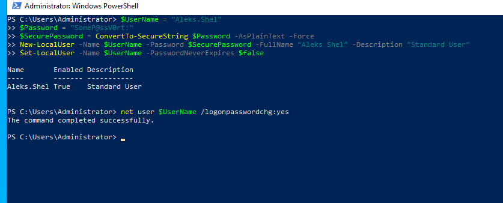

#### 💻🔮👾 Отключение гостевой учётной записи
```powershell
Disable-LocalUser -Name "Guest"
```
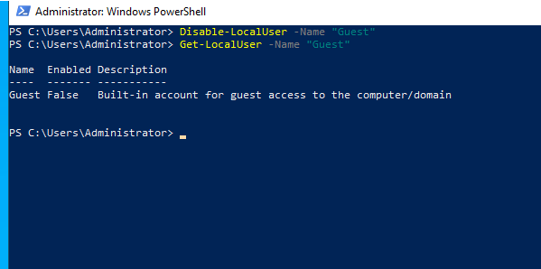

#### 💻🔮👾 Включение "контроля учетных записей" (UAC)

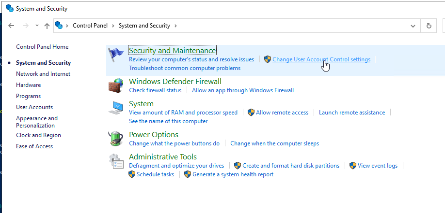
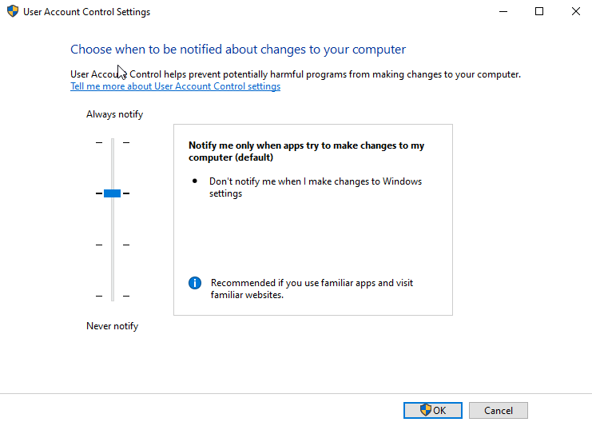


#### 💻🔮👾 Настройка парольной политики:
* Вести журнал паролей - 5 последних паролей
* Максимальный срок действия паролей - 90 дней
* Минимальная длина пароля - 8 символов
* Пароль должен отвечать требованиям сложности - Включен
* Пороговое значение блокировки - 5 ошибок
* Продолжительность блокировки УЗ - 15 мин
* Разрешить блокировку УЗ администратора - Включен.
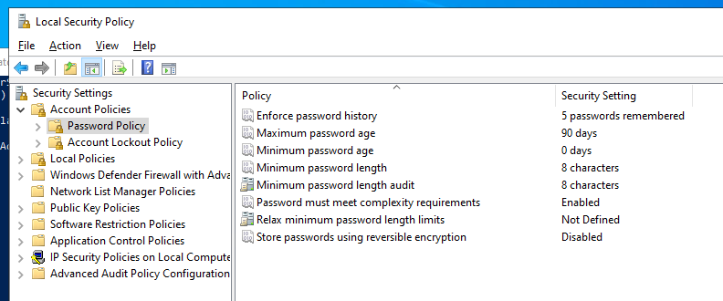
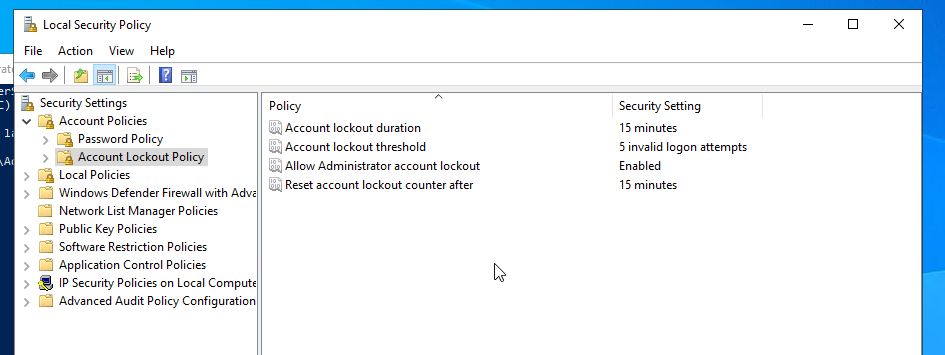

#### 💻🔮👾 Настройка парольной политики PIN (для Windows Hello)```*```:
* Требовать использование цифр - Включена
* Требовать использование строчных букв - Включена
* Минимальная длина PIN-кода - 8 символов
* Срок действия -90 дней
* Журнал -5 последних паролей
* Требовать использование специальных символов - Включена
* Требовать использование прописных букв - Включена
```powershell
Set-ItemProperty -Path "HKLM:\SOFTWARE\Policies\Microsoft\PassportForWork\PINComplexity" -Name "RequireDigits" -Value 1
Set-ItemProperty -Path "HKLM:\SOFTWARE\Policies\Microsoft\PassportForWork\PINComplexity" -Name "LowercaseLetters" -Value 1
Set-ItemProperty -Path "HKLM:\SOFTWARE\Policies\Microsoft\PassportForWork\PINComplexity" -Name "MinimumPINLength" -Value 8
Set-ItemProperty -Path "HKLM:\SOFTWARE\Policies\Microsoft\PassportForWork\PINComplexity" -Name "Expiration" -Value 90
Set-ItemProperty -Path "HKLM:\SOFTWARE\Policies\Microsoft\PassportForWork\PINComplexity" -Name "PINHistory" -Value 5
Set-ItemProperty -Path "HKLM:\SOFTWARE\Policies\Microsoft\PassportForWork\PINComplexity" -Name "SpecialCharacters" -Value 1
Set-ItemProperty -Path "HKLM:\SOFTWARE\Policies\Microsoft\PassportForWork\PINComplexity" -Name "UppercaseLetters" -Value 1
```
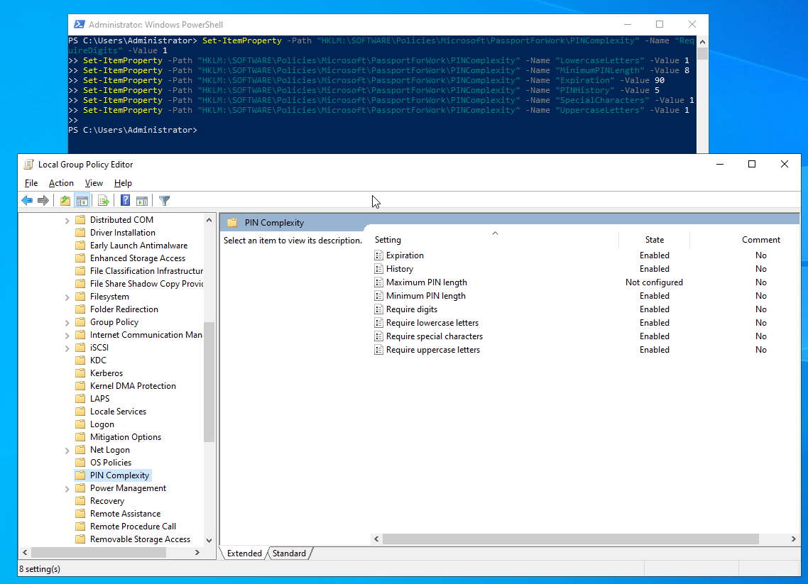
```*``` _Компонент Windows Hello for Business недоступен на Windows Server 2022.<br>
Это ожидаемое поведение, так как Windows Hello в основном ориентирован на клиентские версии Windows (например, Windows 10 и Windows 11), а не на серверные операционные системы.<br>
На серверных системах для управления безопасностью чаще используются такие решения, как Active Directory, многофакторная аутентификация (MFA) и другие корпоративные решения, которые лучше интегрируются в серверную инфраструктуру._

_Вместо Windows Hello, можно настроить другие методы аутентификации, такие как Smart Cards или MFA, с помощью Active Directory или сторонних решений.
Использование PIN через политики безопасности: Если необходимо работать с PIN-кодами или другими подобными методами аутентификации, их настройку можно производить через Group Policy Management или реестр. Однако без поддержки Windows Hello на серверной версии это может быть затруднительно._

#### 💻🔮👾 Включение RDP для УЗ администратора
```powershell
# Включить удалённый рабочий стол
Set-ItemProperty -Path 'HKLM:\System\CurrentControlSet\Control\Terminal Server\' -Name "fDenyTSConnections" -Value 0

# Разрешить использование NLA
Set-ItemProperty -Path 'HKLM:\System\CurrentControlSet\Control\Terminal Server\WinStations\RDP-Tcp\' -Name "UserAuthentication" -Value 1

# Добавить администратора в группу "Remote Desktop Users"
Add-LocalGroupMember -Group "Remote Desktop Users" -Member "Adminotest"

# Открыть порт для RDP (3389 по умолчанию), если закрыто фаерволом
Enable-NetFirewallRule -DisplayGroup "Remote Desktop"
```
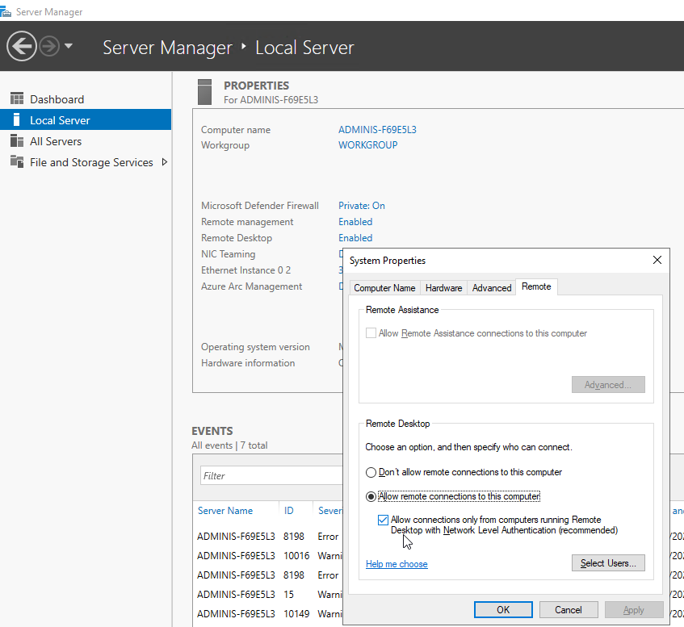
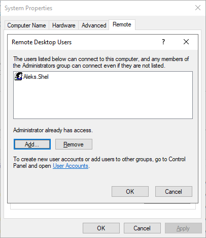

#### 💻🔮👾 Настройка блокировки рабочего стола
```powershell
# Создание параметра и установка времени бездействия компьютера перед блокировкой (в секундах)
New-ItemProperty -Path "HKLM:\SOFTWARE\Microsoft\Windows\CurrentVersion\Policies\System" -Name "InactivityTimeoutSecs" -Value 300 -PropertyType DWord -Force

# Проверка параметра
Get-ItemProperty -Path "HKLM:\SOFTWARE\Microsoft\Windows\CurrentVersion\Policies\System" -Name "InactivityTimeoutSecs"
```
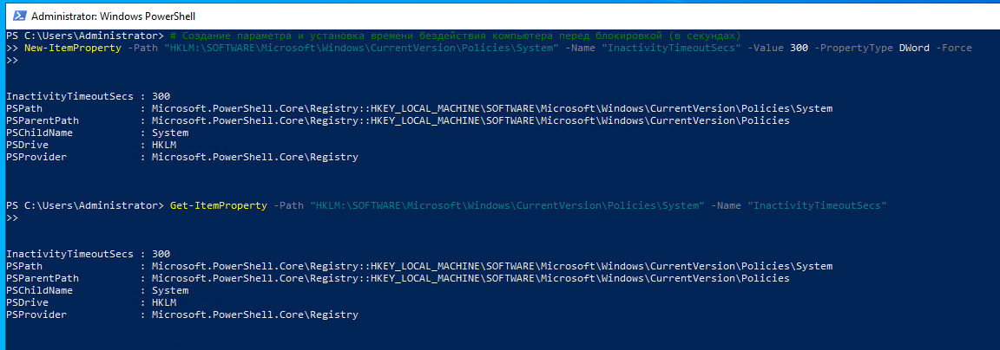

#### 💻🔮👾 Установка антивируса
Использование **Microsoft Defender**, встроенного в **Windows Server 2022**, является лучшим выбором для защиты серверной среды по нескольким причинам. Во-первых, Defender глубоко интегрирован в операционную систему, что гарантирует его оптимальную производительность и минимальное использование ресурсов. Во-вторых, Microsoft регулярно обновляет базы данных сигнатур и механизмы защиты, что делает его высокоэффективным средством борьбы с новыми угрозами. Кроме того, это решение является бесплатным, что значительно снижает затраты на безопасность без ущерба для уровня защиты.

Таким образом, **Microsoft Defender** — это мощный и надёжный инструмент для обеспечения безопасности серверов, который рекомендуется использовать в качестве основной антивирусной защиты на **Windows Server 2022**.

<details><summary>Обоснование:</summary>

1. **Интеграция и надежность**:
   - **Microsoft Defender** глубоко интегрирован в операционную систему Windows Server 2022, что делает его оптимизированным для серверных сред. Это означает, что он работает эффективно с минимальной нагрузкой на ресурсы системы и не требует установки дополнительных компонентов. Также он регулярно обновляется вместе с системой через централизованные механизмы обновлений Windows.

2. **Бесплатная защита на уровне корпоративных решений**:
   - **Microsoft Defender** предоставляет мощные возможности защиты от вредоносного ПО, включая защиту от вирусов, троянов и программ-вымогателей. В отличие от многих сторонних антивирусных решений, Defender не требует дополнительных затрат, что делает его доступным для компаний любого размера.

3. **Поддержка современных угроз и проактивная защита**:
   - Microsoft активно обновляет базы данных сигнатур и алгоритмы анализа поведения, что позволяет **Microsoft Defender** своевременно выявлять и блокировать новые угрозы, защищая серверные системы от самых актуальных атак. Используются такие методы, как защита в реальном времени, облачные анализы и эвристический анализ.

4. **Простота управления и настройки**:
   - Встроенный **Microsoft Defender** легко управляется через **Windows Security** и поддерживает централизованное управление через **Group Policy** или **Microsoft Endpoint Manager**. Это делает его особенно удобным для администраторов, так как они могут контролировать безопасность серверов с помощью стандартных инструментов Windows.

5. **Низкая нагрузка на систему и эффективное использование ресурсов**:
   - Благодаря глубокой интеграции, **Defender** оптимизирован для минимальной нагрузки на ресурсы сервера. Это особенно важно для серверов, которые выполняют критически важные задачи и где любые сторонние решения могут замедлять производительность.

6. **Соответствие стандартам безопасности**:
   - **Microsoft Defender** соответствует большинству стандартов и требований к безопасности, используемых в корпоративных и государственных средах, что делает его идеальным выбором для защиты данных и инфраструктуры.

Чтобы убедительно продемонстрировать возможности и настройки **Microsoft Defender** в **Windows Server 2022**, можно использовать несколько инструментов и команд **PowerShell**, чтобы показать его конфигурацию, возможности и производительность. Это добавит веса вашим доводам.

### Демонстрация возможностей Microsoft Defender через PowerShell:

1. **Проверка текущего статуса Microsoft Defender**:

   Команда позволяет показать, что **Defender** включен и работает на сервере:

   ```powershell
   Get-MpComputerStatus
   ```

   **Вывод**:
   - Покажет такие параметры, как статус защиты в реальном времени, обновления антивирусных баз и состояние сканирования. Например, можно увидеть:
     - **RealTimeProtectionEnabled** — включена ли защита в реальном времени.
     - **AntivirusEnabled** — включён ли антивирус.
     - **NISEnabled** — включена ли защита от сетевых атак.

2. **Запуск быстрой проверки системы**:

   Можно показать, что Defender поддерживает автоматизированное сканирование системы на наличие вредоносного ПО:

   ```powershell
   Start-MpScan -ScanType QuickScan
   ```

   Эта команда запустит быструю проверку, которая покажет, как Microsoft Defender работает в режиме реального времени.

3. **Проверка и установка актуальных обновлений для антивирусных баз**:

   Это важно для демонстрации, что **Defender** всегда актуален и регулярно обновляет базы данных угроз:

   ```powershell
   Update-MpSignature
   ```

   Команда обновит базы данных сигнатур и обеспечит защиту от новых угроз.

4. **Проверка настроек защиты в реальном времени и управления сканированием**:

   ```powershell
   Get-MpPreference
   ```

   **Вывод**:
   - Отображает такие параметры, как:
     - **DisableRealtimeMonitoring** — показывает статус защиты в реальном времени.
     - **ScanAvgCPULoadFactor** — определяет, какую нагрузку антивирус может создавать на процессор во время сканирования.
     - **SubmitSamplesConsent** — показывает, как сервер отправляет образцы на анализ в облачные сервисы Microsoft.

5. **Отключение/включение защиты в реальном времени (если необходимо)**:

   Чтобы продемонстрировать гибкость в управлении, можно временно отключить или включить защиту в реальном времени:

   ```powershell
   Set-MpPreference -DisableRealtimeMonitoring $true  # Отключить
   Set-MpPreference -DisableRealtimeMonitoring $false # Включить
   ```

### Преимущества использования Microsoft Defender:

- **Интеграция с системой**: Поскольку **Microsoft Defender** встроен в ОС, он лучше интегрируется с системными процессами и оказывает минимальное влияние на производительность.
- **Регулярные обновления**: Используя команду **Update-MpSignature**, вы можете показать, как система получает обновления угроз непосредственно от Microsoft.
- **Управление через PowerShell**: Возможности управления через PowerShell, которые я перечислил выше, демонстрируют гибкость и возможность автоматизации. Defender можно контролировать и настраивать через скрипты, что особенно удобно в корпоративной среде.

### Доказательства и ссылки:
- Официальная документация Microsoft по **Microsoft Defender Antivirus**: [Microsoft Docs](https://docs.microsoft.com/en-us/microsoft-365/security/defender-endpoint/microsoft-defender-antivirus-windows?view=o365-worldwide)

Эти команды и доказательства помогут продемонстрировать, что **Microsoft Defender** является надёжным и мощным решением для обеспечения безопасности на **Windows Server 2022**.

</details>

#### 💻🔮👾 Настройка установки обновлений
- Установка и импорт модуля Windows Update PowerShell Module
   ```powershell
   Install-Module -Name PSWindowsUpdate -Force
   Import-Module PSWindowsUpdate
   ```
- Проверка и установка обновлений
   ```powershell
   Get-WindowsUpdate
   Install-WindowsUpdate -AcceptAll -AutoReboot
   ```
- Отключение автоматического изменения периода активности и установка его вручную (с 10:00 до 18:00)
   ```powershell
   Set-ItemProperty -Path "HKLM:\SOFTWARE\Microsoft\WindowsUpdate\UX\Settings" -Name "SmartActiveHoursState" -Value 0
   Set-ItemProperty -Path "HKLM:\SOFTWARE\Microsoft\WindowsUpdate\UX\Settings" -Name "ActiveHoursStart" -Value 10
   Set-ItemProperty -Path "HKLM:\SOFTWARE\Microsoft\WindowsUpdate\UX\Settings" -Name "ActiveHoursEnd" -Value 18
   ```
- Включение уведомлений о необходимости перезагрузки
   ```powershell
   Set-ItemProperty -Path "HKLM:\SOFTWARE\Microsoft\WindowsUpdate\UX\Settings" -Name "RestartNotificationsAllowed2" -Value 1
   ```

#### 💻🔮👾 Шифрование жесткого диска устройства (BitLocker)
У меня VPS, где нет возможности шифровать отдельные диски (так как доступен только диск C:), поэтому шифрование всей директории с помощью BitLocker не поддерживается, так как BitLocker работает на уровне дисков и разделов. Однако, для шифрования папки или директории можно использовать встроенный инструмент EFS (Encrypting File System), который предназначен для шифрования отдельных файлов и папок на уровне файловой системы.

Для демонстрации шифрования диска я отрезада 5 Гб от диска на ноуте и сделала его диском D:
 - Сначала нужно уменьшить раздел **C** на нужный размер. Используйте команду **Resize-Partition**. Пример ниже уменьшает диск на 5 ГБ:

   ```powershell
   # Получение идентификатора раздела C
   $Partition = Get-Partition -DriveLetter C

   # Уменьшение раздела на 5 ГБ
   Resize-Partition -DriveLetter C -Size (($Partition.Size - 5GB) -as [int64])
   ```
 - После того как освободили место, создадим новый раздел и назначим ему букву диска **D**:

   ```powershell
   # Получаем информацию о диске (предположим, это первый диск)
   $Disk = Get-Disk | Where-Object PartitionStyle -ne 'RAW' | Select-Object -First 1

   # Создание нового раздела на освободившемся месте
   New-Partition -DiskNumber $Disk.Number -UseMaximumSize -DriveLetter D
   ```

 - Новый раздел должен быть отформатирован перед использованием:

   ```powershell
   # Форматирование нового раздела с файловой системой NTFS
   Format-Volume -DriveLetter D -FileSystem NTFS -NewFileSystemLabel "NewVolume"
   ```
Теперь у меня есть маленький диск **D**, который можно и зашифровать:


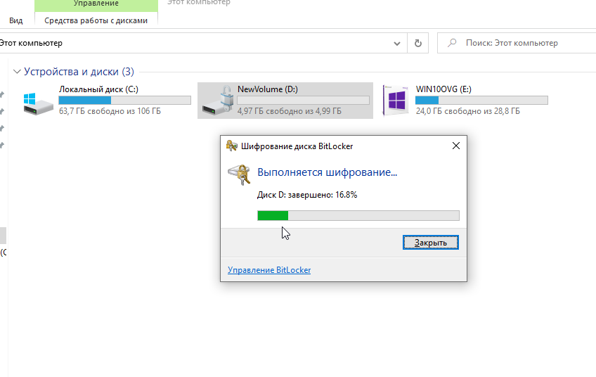

#### 💻🔮👾 Включение брандмауэра и настройка логирования

- **Проверка состояния брандмауэра (включён или отключён)**

```powershell
# Проверить состояние брандмауэра для всех профилей (Domain, Private, Public)
Get-NetFirewallProfile
```
Вывод покажет статус для каждого профиля (Domain, Private, Public). Если **Enabled** равно **True**, брандмауэр активен.

- **Включение брандмауэра для всех профилей** (если он отключён):
```powershell
# Включить брандмауэр для всех профилей
Set-NetFirewallProfile -Profile Domain,Public,Private -Enabled True
```

- **Настройка ведения журнала пропущенных пакетов и успешных подключений для всех профилей (Domain, Private, Public)**:
Используйте команду **Set-NetFirewallProfile** для настройки ведения журнала для каждого профиля:

- **_Включение ведения журнала для доменного профиля_**:

   ```powershell
   Set-NetFirewallProfile -Profile Domain -LogAllowed True -LogBlocked True -LogMaxSizeKilobytes 10240 -LogFileName "C:\Windows\System32\LogFiles\Firewall\pfirewall.log"
   ```

- **_Включение ведения журнала для частного профиля_**:

   ```powershell
   Set-NetFirewallProfile -Profile Private -LogAllowed True -LogBlocked True -LogMaxSizeKilobytes 10240 -LogFileName "C:\Windows\System32\LogFiles\Firewall\pfirewall.log"
   ```

- **_Включение ведения журнала для публичного профиля_**:

   ```powershell
   Set-NetFirewallProfile -Profile Public -LogAllowed True -LogBlocked True -LogMaxSizeKilobytes 10240 -LogFileName "C:\Windows\System32\LogFiles\Firewall\pfirewall.log"
   ```
- Проверка настроек:

   ```powershell
   Get-NetFirewallProfile | Select-Object -Property Name, LogAllowed, LogBlocked, LogMaxSizeKilobytes, LogFileName
   ```

### Пояснение:
- **LogAllowed** — включает ведение журнала для разрешённых подключений.
- **LogBlocked** — включает ведение журнала для заблокированных подключений.
- **LogMaxSizeKilobytes** — устанавливает максимальный размер файла журнала.
- **LogFileName** — путь к файлу журнала.


   
---

</details>

### 4. Добавить роль контроллера домена Active Directory
- имя домена "фамилия латиницей". local (smirnov.local)
- имя windows server ns1
- приложить скрины выполненных заданий

<details>
  <summary>Выполнение:</summary>

Добавить роль контроллера домена **Active Directory** на **Windows Server** можно через **Server Manager** или **PowerShell**.

#### Шаги через **Server Manager**:

- **Добавление роли Active Directory**:
   - **Пуск** → **Server Manager**, выберите **Add roles and features**.
   - В мастере выбора ролей выберите **Active Directory Domain Services (AD DS)** и установите все необходимые компоненты.
   - После установки AD DS, появится кнопка для повышения сервера до контроллера домена (**Promote this server to a domain controller**).

- **Создание нового домена**:
   - Выберите **Add a new forest** и введите имя домена: `domenchik.local`.
   - На следующем экране выберите **Forest functional level** и **Domain functional level**. Установите необходимые параметры (по умолчанию можно оставить **Windows Server 2016** или более новое).
   - Установите пароль для **Directory Services Restore Mode (DSRM)**.
   - Продолжите настройку до завершения процесса.
   - После завершения конфигурации сервер перезагрузится, и теперь он будет доменным контроллером для домена `smirnov.local`.

### Использование **PowerShell**:

Через PowerShell можно выполнить всё то же самое:

- **Изменение имени компьютера**:

```powershell
Rename-Computer -NewName "ns1" -Force -Restart
```
Сервер перезагрузится, и его имя изменится на **ns1**.

- **Добавление роли Active Directory**:

```powershell
Install-WindowsFeature -Name AD-Domain-Services -IncludeManagementTools
```

- **Повышение сервера до контроллера домена**:

```powershell
Install-ADDSForest -DomainName "domenchik.local" -DomainNetbiosName "DOMENCHIK" -ForestMode "Default" -DomainMode "Default" -SafeModeAdministratorPassword (ConvertTo-SecureString "YourPasswordHere" -AsPlainText -Force) -Force
```
Заменить `"YourPasswordHere"` на свой пароль для **Directory Services Restore Mode** (DSRM).

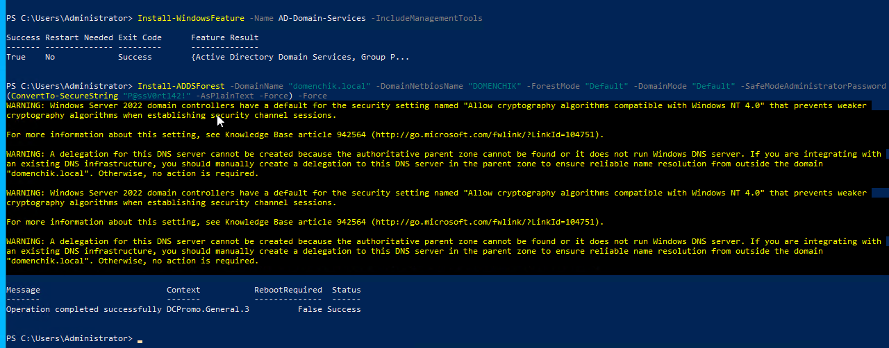

- **После установки**:
   Сервер перезагрузится, и теперь ваш сервер будет контроллером домена для домена `domenchik.local`.

### Примечания:
- Убедитесь, что имя сервера **ns1** установлено до начала установки, или измените его после.
- После установки AD DS вы можете управлять пользователями и группами через **Active Directory Users and Computers**.

После того, как сервер перезагрузится и станет контроллером домена, вы можете проверить это с помощью нескольких команд PowerShell, чтобы убедиться, что сервер правильно настроен как контроллер домена.

- **Проверка информации о домене**:

   ```powershell
   Get-ADDomain
   ```
   Эта команда выведет информацию о домене, включая имя домена, контроллеры домена, и функциональные уровни.

  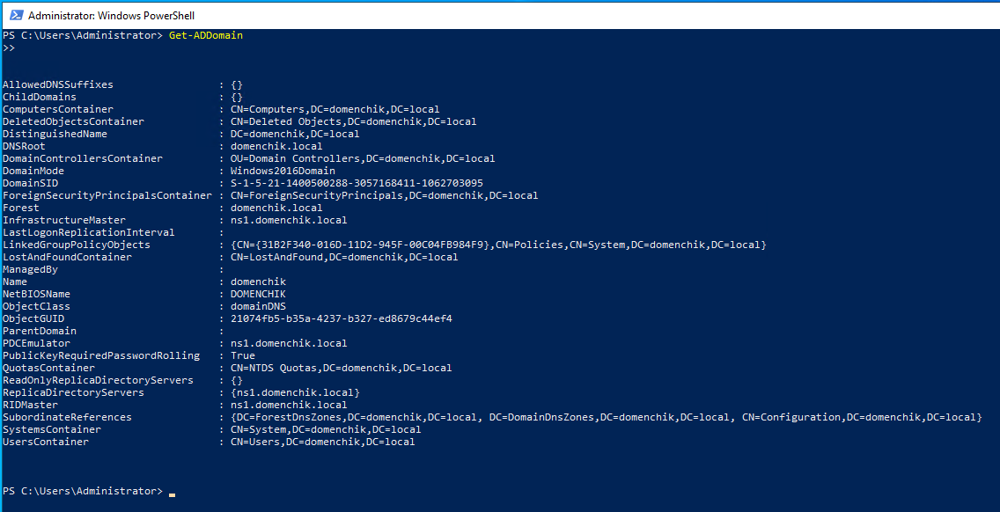
  
- **Проверка контроллеров домена**:

   ```powershell
   Get-ADDomainController
   ```
   Эта команда покажет список контроллеров домена, и ваш сервер должен быть среди них с именем **ns1**.

  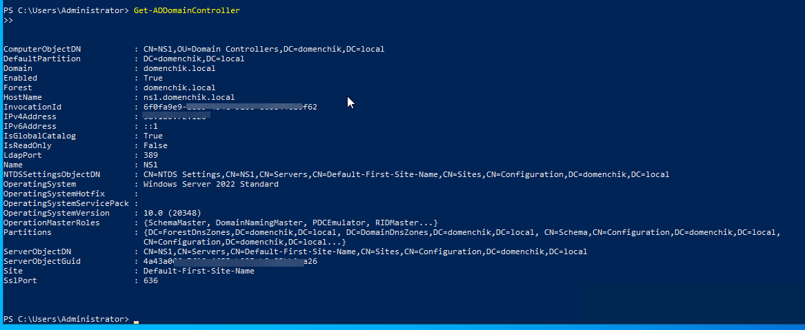

- **Проверка роли Active Directory Domain Services (AD DS)**:
   Чтобы убедиться, что роль AD DS установлена и сервер является контроллером домена, используйте команду:

   ```powershell
   Get-WindowsFeature -Name AD-Domain-Services
   ```

   Вы должны увидеть статус **Installed**, что означает, что роль AD DS успешно установлена.

- **Проверка статуса служб Active Directory**:
   Для проверки статуса служб можно использовать следующую команду:

   ```powershell
   Get-Service -Name NTDS
   ```

   Если служба **NTDS** (служба каталога Active Directory) работает, это подтверждает, что сервер функционирует как контроллер домена.

### Пример вывода:

- **Get-ADDomain** вернёт информацию о домене, включая его имя и NetBIOS имя.
- **Get-ADDomainController** покажет список контроллеров домена, где ваш сервер будет указан как контроллер домена.
- **Get-WindowsFeature** покажет, что роль AD DS установлена.

Эти команды помогут вам убедиться, что сервер правильно настроен и функционирует как контроллер домена.

  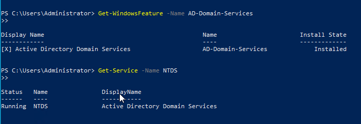

-----
</details>

### 4.*  Настроить службу DNS.
- Изменить имя windows server на ns1
- Поднять DNS на Windows server
- Добавить A записи DNS, в том числе и для VM ubuntu, metasploit, kali
- Осуществить dig вашего name servera, отчет приложить
- Осуществить ping запрос по доменному имени всеx VM

<details><summary>Выполнение:</summary>
Имя я уже изменила на ns1 в прошлом шаге
 
- #### Установка и настройка роли DNS на Windows Server (если ещё не установлено)

  - Открыть **Server Manager** → **Add roles and features**.
  - В мастере выбора ролей выбрать **DNS Server** и установить все необходимые компоненты.
  - После завершения установки открыть **DNS Manager** (можно найти через поиск в Пуске).

У меня роль установлена уже:
  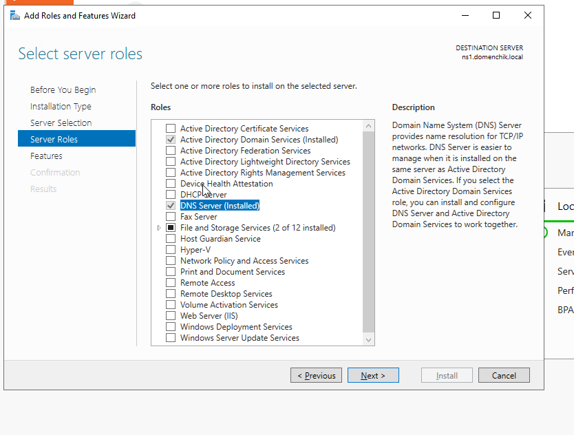

- #### Настройка A-записей для DNS

  - ##### В **DNS Manager**:
    - Открыть узел вашего домена (например, **domenchik.local**).
    - ПКМ на зоне **Forward Lookup Zones** → **New Host (A or AAAA)**.
    - Ввести имя каждой виртуальной машины (например, **ubuntu**, **metasploit**, **kali**) и их соответствующие IP-адреса.

    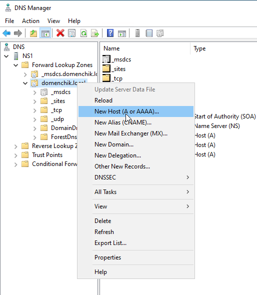

    Пример A-записей:
    - **ubuntu.domenchik.local** → IP: 57.39.7.30
    - **metasploit.domenchik.local** → IP: 31.11.45.42
    - **kali.domenchik.local** → IP: 53.18.2.82

    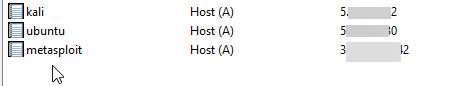


- #### Проверка DNS с помощью **dig**
Если проверять а какой-то другой машине: так как у нас domenchik.local в "глобальном" DNS неизвестен, то нужно дигать с IP сервера, где подняли DNS (например, 36.203.12.100). Если проверять на той же машине, где поднимали DNS, то @36.203.12.100 не нужно указывать.

  - На **Windows Server** или любой другой машине, поддерживающей **dig**, выполните команду:

   ```bash
   dig ns1.domenchik.local @36.203.12.100
   dig kali.domenchik.local @36.203.12.100
   dig ubuntu.domenchik.local @36.203.12.100
   dig metasploit.domenchik.local @36.203.12.100
   ```
   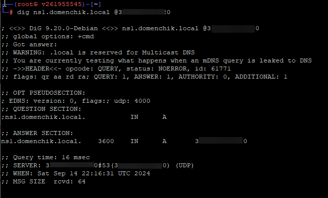
   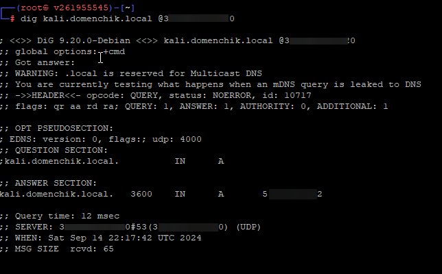
   
   Чтобы сократить вывод команды до минмума, можно добавить +short
   
   

  На Windows ещё можно использовать nslookup:
  
  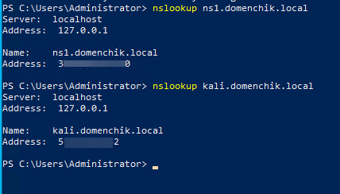


- #### Ping запрос по доменным именам всех VM

  - В PowerShell и выполнить команды:

   ```powershell
   ping ubuntu.domenchik.local
   ping metasploit.domenchik.local
   ping kali.domenchik.local
   ```
Результат:

 ```powershell   
PS C:\Users\Administrator> ping kali.domenchik.local

Pinging kali.domenchik.local [53.18.2.82] with 32 bytes of data:
Reply from 53.18.2.82: bytes=32 time=12ms TTL=56
Reply from 53.18.2.82: bytes=32 time=12ms TTL=56
Reply from 53.18.2.82: bytes=32 time=12ms TTL=56
Reply from 53.18.2.82: bytes=32 time=12ms TTL=56

Ping statistics for 53.18.2.82:
    Packets: Sent = 4, Received = 4, Lost = 0 (0% loss),
Approximate round trip times in milli-seconds:
    Minimum = 12ms, Maximum = 12ms, Average = 12ms
PS C:\Users\Administrator> ping ubuntu.domenchik.local

Pinging ubuntu.domenchik.local [57.39.7.30] with 32 bytes of data:
Reply from 57.39.7.30: bytes=32 time=12ms TTL=57
Reply from 57.39.7.30: bytes=32 time=12ms TTL=57
Reply from 57.39.7.30: bytes=32 time=12ms TTL=57
Reply from 57.39.7.30: bytes=32 time=12ms TTL=57

Ping statistics for 57.39.7.30:
    Packets: Sent = 4, Received = 4, Lost = 0 (0% loss),
Approximate round trip times in milli-seconds:
    Minimum = 12ms, Maximum = 12ms, Average = 12ms
PS C:\Users\Administrator>
```
  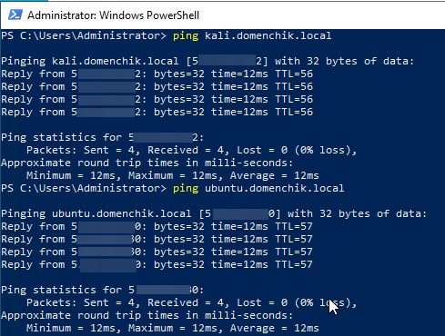

Для metasploit.domenchik.local пинга не будет, т.к. я указала в качестве этого хоста другую свою машину с Windows, там пинги закрыты.


-----

</details>


### Ссылки на дополнительные ресурсы
[Как работает Windows](https://uchet-jkh.ru/i/kak-rabotaet-operacionnaya-sistema-windows-principy-i-funkcionalnost/)<br>
[regedit.exe Реестр Windows](https://itspectr.ru/chto-takoe-reestr-windows-vvodnaya-chast/)<br>
[Network protocol Kerberos](https://www.keepersecurity.com/ru_RU/resources/glossary/what-is-kerberos/)<br>
[Audit Windows настройка для SOC](https://www.anti-malware.ru/practice/methods/Setting-up-auditing-in-Windows-for-full-SOC-monitoring)<br>
[Групповые политики GPO Windows](https://1cloud.ru/help/windows/gruppovye-politiki-active-directory)<br>
[GPO Windows server Best Practice](https://winitpro.ru/index.php/category/group-policy/)<br>
[LAPS утилита для безопасности локальных паролей AD](https://activedirectorypro.com/microsoft-laps-setup-install-guide/)<br>
