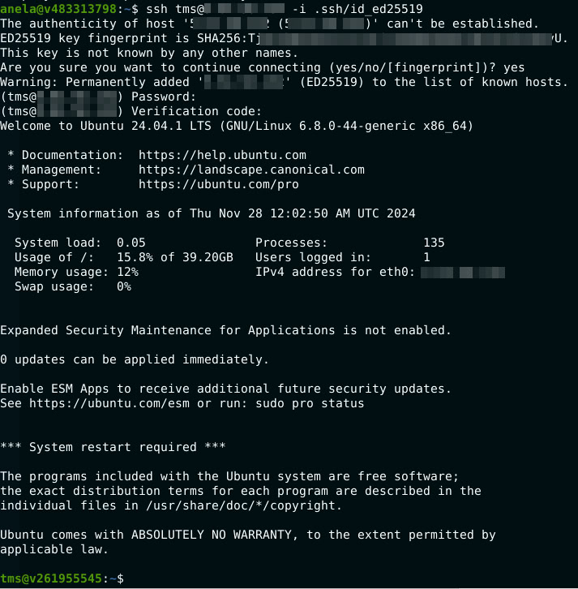

# Домашняя работа № 18
### Защита инфраструктуры приложений
*часть 2 : honeypot, sandbox, DAC, MFA*

---

1. **Установить 2FA на linux (Google authenticator)**
    - Прислать скрин о запросе кода авторизации 

<details>
  <summary> Выполнение </summary>
  
Установка Google Authenticator

```
sudo apt update
sudo apt install libpam-google-authenticator -y
```

Настройка

```
google-authenticator
tms@v261955545:~$ google-authenticator

Do you want authentication tokens to be time-based (y/n) y
Warning: pasting the following URL into your browser exposes the OTP secret to Google:
  https://www.google.com/chart?chs=200x200&chld=M|0&cht=qr&chl=otpauth://totp/tms@v261955545.local%3Fsecret%3**************************2HI%26issuer%3Dv261955545.local
                                                                                         
Your new secret key is: XS**********************I
Enter code from app (-1 to skip): 095002
Code confirmed
Your emergency scratch codes are:
  21****51
  5******3
  6******6
  3*****34
  4******0

Do you want me to update your "/home/tms/.google_authenticator" file? (y/n) y

Do you want to disallow multiple uses of the same authentication
token? This restricts you to one login about every 30s, but it increases
your chances to notice or even prevent man-in-the-middle attacks (y/n) y

By default, a new token is generated every 30 seconds by the mobile app.
In order to compensate for possible time-skew between the client and the server,
we allow an extra token before and after the current time. This allows for a
time skew of up to 30 seconds between authentication server and client. If you
experience problems with poor time synchronization, you can increase the window
from its default size of 3 permitted codes (one previous code, the current
code, the next code) to 17 permitted codes (the 8 previous codes, the current
code, and the 8 next codes). This will permit for a time skew of up to 4 minutes
between client and server.
Do you want to do so? (y/n) y

If the computer that you are logging into isn't hardened against brute-force
login attempts, you can enable rate-limiting for the authentication module.
By default, this limits attackers to no more than 3 login attempts every 30s.
Do you want to enable rate-limiting? (y/n) y
```

Далее - добавление в /etc/pam.d/sshd

```
auth required pam_google_authenticator.so"
```

И чтобы в /etc/ssh/sshd_config было это:

```
ChallengeResponseAuthentication yes
UsePAM yes
AuthenticationMethods publickey,password publickey,keyboard-interactive

```

Вот что получается:



</details>

2. **any.run**
    - регистрируемся, тестим ссылки и файлы в sandbox

<details>
  <summary> Выполнение </summary>
  
В процессе

</details>


---

## Дополнительные ресурсы:

- [Dynamic Access Control в Windows Server](https://winitpro.ru/index.php/2013/01/24/dynamic-access-control-v-windows-server-2012/)
- [Настройка 2FA для SSH Linux](https://dzen.ru/a/Yo052tNMkSmr3U9o)
- [Configure 2FA on Ubuntu (english)](https://www.linuxbabe.com/ubuntu/two-factor-authentication-ssh-key-ubuntu)
- [ANY.RUN sandbox и анализ уязвимостей](https://any.run)
- [Примеры различных Honeypots](https://habr.com/ru/companies/bastion/articles/731172/)
- [Как повысить привилегии LotL attack and GFTObins](https://habr.com/ru/companies/oleg-bunin/articles/799773/)

