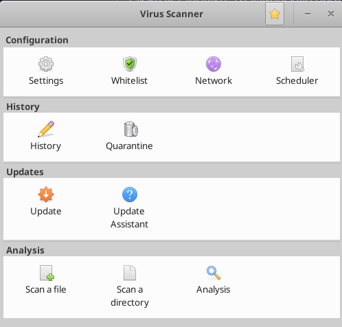
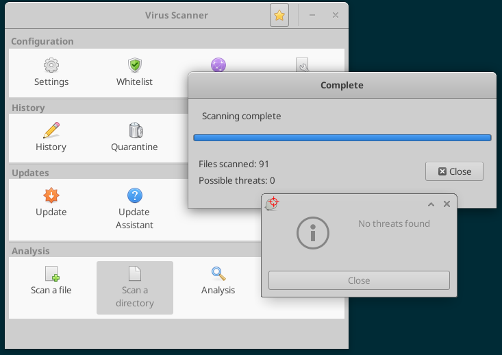

# Домашняя работа № 179
### Основные виды СЗИ
*часть 1 : AV, NGFW, PAM, DLP, XDR, EDR, MDR*

---

## Задачи:


1. **Установить антивирус ClamAV**
    - Также установить графическую оболочку
    - Просканировать любую директорию


<details>
  <summary> Выполнение </summary>
  
Устанавливается проще простого, просто из репы:

```
sudo apt install clamav -y
```

Увы, скриншотов установки clamav и clamtk нет только потому, что при установке соединение по RDP обрывалось, приходилось переподключаться, убивать все сессии и открывать бразуер и всё остальное занова.

Хороший урок: запускать в фоновом режиме подобное (screen), чтобы даже если сессия прервётся, можно было вернуться к процессу.


Графическую оболочку установила стандартную - Clamtk

```
sudo apt install clamtk -y
```

Вот так она выглядит:



Я просканировала директорию Downloads с помощью Clamtk. При этом можно было увидеть в процессах вот такую команду:

```
/usr/bin/clamscan --no-summary --block-encrypted --scan-mail=no --scan-archive=yes --max-scansize=500M --exclude-dir=smb4k --exclude-dir=/run/user/anela/gvfs --exclude-dir=/home/anela/.gvfs --exclude-dir=^/home/anela/.clamtk/viruses --exclude-dir=^/sys/ --exclude-dir=^/dev/ --exclude-dir=^/proc/ --exclude-dir=.thunderbird --exclude-dir=.mozilla-thunderbird --exclude-dir=Mail --exclude-dir=kmail --exclude-dir=evolution --exclude-dir=timeshift --exclude=\/\. --heuristic-alerts=no --max-filesize=20M --max-dir-recursion=1 -v /home/anela/Download
```

Ничего не было обнаружено:




</details>

2. **Установить YARA**
    - Создать текстовый файл и вычислить его hash
    - Написать правило для детектирования данного файла


<details>
  <summary> Выполнение </summary>

Установила yara из репозитория:

```bash
tms@v261955545:~$ sudo apt install yara
Reading package lists... Done
Building dependency tree... Done
Reading state information... Done
The following additional packages will be installed:
  libyara10
The following NEW packages will be installed:
  libyara10 yara
0 upgraded, 2 newly installed, 0 to remove and 3 not upgraded.
Need to get 226 kB of archives.
After this operation, 612 kB of additional disk space will be used.
Do you want to continue? [Y/n] 
Get:1 http://cdn.archive.ubuntu.com/ubuntu noble/universe amd64 libyara10 amd64 4.5.0-1build2 [203 kB]
Get:2 http://cdn.archive.ubuntu.com/ubuntu noble/universe amd64 yara amd64 4.5.0-1build2 [23.6 kB]
Fetched 226 kB in 0s (2,086 kB/s)
Selecting previously unselected package libyara10:amd64.
(Reading database ... 138021 files and directories currently installed.)
Preparing to unpack .../libyara10_4.5.0-1build2_amd64.deb ...
Unpacking libyara10:amd64 (4.5.0-1build2) ...
Selecting previously unselected package yara.
Preparing to unpack .../yara_4.5.0-1build2_amd64.deb ...
Unpacking yara (4.5.0-1build2) ...
Setting up libyara10:amd64 (4.5.0-1build2) ...
Setting up yara (4.5.0-1build2) ...
Processing triggers for man-db (2.12.0-4build2) ...
Processing triggers for libc-bin (2.39-0ubuntu8.3) ...
Scanning processes...                                                                                                                                                                                              
Scanning candidates...                                                                                                                                                                                             
Scanning linux images...                                                                                                                                                                                           

Pending kernel upgrade!
Running kernel version:
  6.8.0-44-generic
Diagnostics:
  The currently running kernel version is not the expected kernel version 6.8.0-49-generic.

Restarting the system to load the new kernel will not be handled automatically, so you should consider rebooting.

Restarting services...

Service restarts being deferred:
 /etc/needrestart/restart.d/dbus.service
 systemctl restart systemd-logind.service
 systemctl restart unattended-upgrades.service

No containers need to be restarted.

No user sessions are running outdated binaries.

No VM guests are running outdated hypervisor (qemu) binaries on this host.
tms@v261955545:~$
```

Создала файл, посчитала его хэш:

```bash
tms@v261955545:~$ vi blablafile
tms@v261955545:~$ sha256sum blablafile
9dceb9572cde40c2c6649680f7a25b10fd1cbaddf2445748e149782039b43a8e  blablafile
```

И создала файл с правилом для нахождения этого файла:

```
import "hash"

rule findblabla
{
  meta:
    description = "Detect file with specific SHA256 hash"
    author = "AledraNax"
    date = "2024-11-27"

  condition:
    hash.sha256(0, filesize) == "9dceb9572cde40c2c6649680f7a25b10fd1cbaddf2445748e149782039b43a8e"
}


```

Проверила, что у yara есть модуль hash:

```bash
tms@v261955545:~$ yara -M
tests
pe
elf
math
time
console
string
dotnet
cuckoo
magic
hash
macho
dex
```

Ну и при проверке по этому правилу получила результат:

```bash
tms@v261955545:~$ yara -r mydetect.yara .
findblabla ./blablafile
```

</details>

3. **Установить WAF (nginx + Modsecurity)**
    - установить и протестировать запрет тестового запроса

<details>
  <summary> Выполнение </summary>
  
===Установка/настройка===

Установила nginx:

```
sudo apt update
sudo apt install nginx
sudo systemctl start nginx
sudo systemctl enable nginx
```

И модуль ModSecurity для него:

```
sudo apt update
sudo apt install -y autoconf automake libtool build-essential git libpcre3-dev zlib1g-dev libssl-dev libmodsecurity3 libmodsecurity-dev
sudo apt install libnginx-mod-http-modsecurity
```

Включение и настройка:

```
sudo mkdir -p /etc/nginx/modsec
sudo wget https://raw.githubusercontent.com/SpiderLabs/ModSecurity/v3/master/modsecurity.conf-recommended -O /etc/nginx/modsec/modsecurity.conf
sudo sed -i 's/SecRuleEngine DetectionOnly/SecRuleEngine On/' /etc/nginx/modsec/modsecurity.conf
# OWASP Core Rule Set (CRS)
sudo git clone https://github.com/coreruleset/coreruleset.git /etc/nginx/modsec-crs
sudo cp /etc/nginx/modsec-crs/crs-setup.conf.example /etc/nginx/modsec-crs/crs-setup.conf
sudo wget https://raw.githubusercontent.com/SpiderLabs/ModSecurity/v3/master/unicode.mapping -O /etc/nginx/modsec/unicode.mapping
```

добавить строки в /etc/nginx/modsec/modsecurity.conf

```
Include /etc/nginx/modsec-crs/crs-setup.conf
Include /etc/nginx/modsec-crs/rules/*.conf
```

Добавить правило:

```
SecRule ARGS:testparam "@contains tmsme" "id:1234,phase:2,deny,status:444,msg:'Test rule triggered'"
```
Объяснение:
    ARGS:testparam: правило срабатывает, если в параметре testparam содержится слово tmsme.
    deny,status:403: запрос будет отклонён с HTTP-кодом 444.
    msg: 'Test rule triggered': сообщение, записываемое в логах ModSecurity.


Перезапуск nginx:

```
sudo systemctl restart nginx
```

===Тестирование===


Для тестирования запрета запроса с помощью Nginx и ModSecurity можно использовать простые HTTP-запросы, которые должны быть заблокированы при правильно настроенном WAF.


Проверяем добавленное в /etc/nginx/modsec/modsecurity.conf правило:


```
curl -X GET "http://localhost/?testparam=tmsme"
```

и если всё ок настроено, получим вот такое в лог ошибок nginx:

```
==> /var/log/nginx/error.log <==
2024/11/30 01:42:44 [error] 100812#100812: *1 [client ::1] ModSecurity: Access denied with code 444 (phase 2). Matched "Operator `Contains' with parameter `tmsme' against variable `ARGS:testparam' (Value: `tmsme' ) [file "/etc/nginx/modsec/modsecurity.conf"] [line "279"] [id "1234"] [rev ""] [msg "Test rule triggered"] [data ""] [severity "0"] [ver ""] [maturity "0"] [accuracy "0"] [hostname "::1"] [uri "/"] [unique_id "173293096454.716472"] [ref "o0,5v16,5"], client: ::1, server: _, request: "GET /?testparam=tmsme HTTP/1.1", host: "localhost"
```


Проверим, работает ли OWASP CRS (OWASP Core Rule Set)

```
curl -X GET "http://localhost/?id=1' OR '1'='1"
```

Это мы увидим в логе ошибок, если работает:

```
curl: (3) URL rejected: Malformed input to a URL function
tms@v261955545:~$ curl -X GET "http://localhost/?id=1%27+OR+%271%27%3D%271"
2024/11/30 01:45:43 [error] 100813#100813: *2 [client ::1] ModSecurity: Access denied with code 403 (phase 2). Matched "Operator `Ge' with parameter `5' against variable `TX:BLOCKING_INBOUND_ANOMALY_SCORE' (Value: `5' ) [file "/etc/nginx/modsec-crs/rules/REQUEST-949-BLOCKING-EVALUATION.conf"] [line "222"] [id "949110"] [rev ""] [msg "Inbound Anomaly Score Exceeded (Total Score: 5)"] [data ""] [severity "0"] [ver "OWASP_CRS/4.10.0-dev"] [maturity "0"] [accuracy "0"] [tag "anomaly-evaluation"] [tag "OWASP_CRS"] [hostname "::1"] [uri "/"] [unique_id "173293114378.818854"] [ref ""], client: ::1, server: _, request: "GET /?id=1%27+OR+%271%27%3D%271 HTTP/1.1", host: "localhost"
<html>
<head><title>403 Forbidden</title></head>
<body>
<center><h1>403 Forbidden</h1></center>
<hr><center>nginx/1.24.0 (Ubuntu)</center>
</body>
</html>
```

</details>


---

## Дополнительные ресурсы:

- [Настройка Jump Server - Bastion](https://habr.com/ru/companies/cloud4y/articles/530516/)
- [MDR архитектура от Kaspersky](https://support.kaspersky.com/MDR/ru-RU/196548.html)
- [YARA installation and docs](https://yara.readthedocs.io/en/latest/gettingstarted.html#)
- [YARA команды проверки]()
- [Nginx + Modsecurity WAF](https://opsshield.com/help/cpguard/install-modsecurity-with-nginx-on-debian-ubuntu/)
- [Smirnov nginx + modsecurity github](https://github.com/sm1lexops/Profile_challenges?tab=readme-ov-file#5-%D0%BF%D1%80%D0%B5%D0%B4%D0%BB%D0%BE%D0%B6%D0%B8%D1%82%D0%B5-%D1%81%D1%85%D0%B5%D0%BC%D1%83-%D0%B8%D0%BD%D1%82%D0%B5%D0%B3%D1%80%D0%B0%D1%86%D0%B8%D0%B8-web-application-firewall-waf-%D0%B2-%D0%B8%D0%BD%D1%84%D1%80%D0%B0%D1%81%D1%82%D1%80%D1%83%D0%BA%D1%82%D1%83%D1%80%D0%B5-%D0%BD%D0%B0%D0%BF%D0%B8%D1%88%D0%B8%D1%82%D0%B5-%D0%BA%D0%BE%D0%BD%D1%84%D0%B8%D0%B3%D1%83%D1%80%D0%B0%D1%86%D0%B8%D1%8E-%D0%B4%D0%BB%D1%8F-%D0%B2%D0%BD%D0%B5%D0%B4%D1%80%D0%B5%D0%BD%D0%B8%D1%8F-waf-%D0%BD%D0%B0%D0%BF%D1%80%D0%B8%D0%BC%D0%B5%D1%80-modsecurity-%D0%B2-nginx-%D0%BD%D0%B0%D0%BF%D0%B8%D1%88%D0%B8%D1%82%D0%B5-%D0%BA%D0%BE%D0%BD%D0%BA%D1%80%D0%B5%D1%82%D0%BD%D1%8B%D0%B5-%D0%BF%D1%80%D0%B8%D0%BC%D0%B5%D1%80%D1%8B-%D0%BF%D1%80%D0%B0%D0%B2%D0%B8%D0%BB-%D0%B1%D0%B5%D0%B7%D0%BE%D0%BF%D0%B0%D1%81%D0%BD%D0%BE%D1%81%D1%82%D0%B8-%D0%BA%D0%BE%D1%82%D0%BE%D1%80%D1%8B%D0%B5-%D0%B2%D1%8B-%D0%B1%D1%8B-%D0%BF%D1%80%D0%B8%D0%BC%D0%B5%D0%BD%D0%B8%D0%BB%D0%B8-%D0%B2-waf-%D0%BD%D0%B0%D0%BF%D1%80%D0%B8%D0%BC%D0%B5%D1%80-%D1%84%D0%B8%D0%BB%D1%8C%D1%82%D1%80%D0%B0%D1%86%D0%B8%D1%8F-sql-%D0%B8%D0%BD%D1%8A%D0%B5%D0%BA%D1%86%D0%B8%D0%B9-xss-%D0%B0%D1%82%D0%B0%D0%BA-%D0%B1%D0%BB%D0%BE%D0%BA%D0%B8%D1%80%D0%BE%D0%B2%D0%BA%D0%B0-%D0%B7%D0%B0%D0%B4%D0%B0%D0%BD%D0%BD%D1%8B%D1%85-%D0%BF%D0%B0%D1%82%D1%82%D0%B5%D1%80%D0%BD%D0%BE%D0%B2)
- [NGFW  free course](https://www.youtube.com/watch?v=uOMiC1-iwIc&list=PLqio-3dnMW5_2cStMfIezwcAzzDCjX86C)
