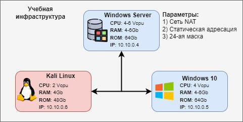
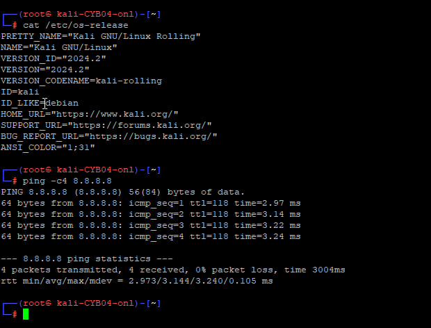
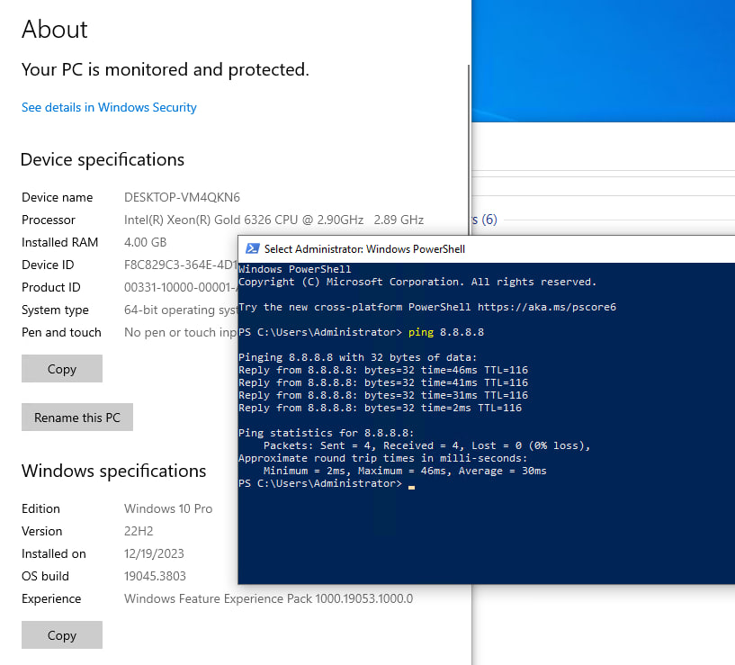

# Домашнее задание №2




### <p align="center"> _VPS с Kali_ </p>
<br>**Ресурсы:**
```3 vcpu, 40 Gb HDD, 4 Gb RAM```<br>



### <p align="center"> _VPS с Windows server 2022_ </p>
<br>**Ресурсы:**
```6 vcpu, 40 Gb HDD, 4 Gb RAM```<br>


### <p align="center"> _VPS с Windows 10 Pro_ </p>
<br>**Ресурсы:**
```4 vcpu, 40 Gb HDD, 4 Gb RAM```<br>


Сеть везде есть, т.е. VPS друг друга видят. Ресурсы можно добавлять.<br>
Суть задания достигнута.
