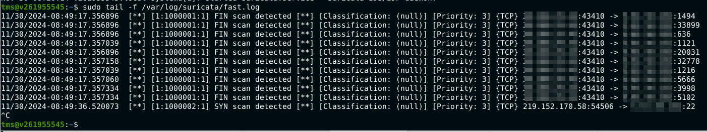

# Домашняя работа № 20
### Основные виды СЗИ
*часть 2 : Dos/DDos, IDS/IPS, Windows Defender*

---

## Задачи:

1. **Установка и тестирование Suricata IDS**
    - Установить Suricata
    - Добавить правило FIN or SIN сканирования в Suricata
    - Перезагрузить Suricata
    - Запустить Kali Linux и просканировать виртуалку с Suricata
    - Предоставить скриншоты и лог-файл Suricata при сканировании

<details>
  <summary> Выполнение </summary>
  
1. Установка (из репозитория):

```
sudo apt install suricata
```

Убеждаемся, что всё установилось:

```bash
tms@v261955545:~$ suricata --build-info
This is Suricata version 7.0.3 RELEASE
Features: NFQ PCAP_SET_BUFF AF_PACKET HAVE_PACKET_FANOUT LIBCAP_NG LIBNET1.1 HAVE_HTP_URI_NORMALIZE_HOOK PCRE_JIT HAVE_NSS HTTP2_DECOMPRESSION HAVE_LUA HAVE_LUAJIT HAVE_LIBJANSSON TLS TLS_C11 MAGIC RUST 
SIMD support: SSE_4_2 SSE_4_1 SSE_3 
Atomic intrinsics: 1 2 4 8 16 byte(s)
64-bits, Little-endian architecture
GCC version 13.2.0, C version 201112
compiled with _FORTIFY_SOURCE=2
L1 cache line size (CLS)=64
thread local storage method: _Thread_local
compiled with LibHTP v0.5.46, linked against LibHTP v0.5.46

Suricata Configuration:
  AF_PACKET support:                       yes
  AF_XDP support:                          yes
  DPDK support:                            yes
  eBPF support:                            yes
  XDP support:                             yes
  PF_RING support:                         no
  NFQueue support:                         yes
  NFLOG support:                           yes
  IPFW support:                            no
  Netmap support:                          no 
  DAG enabled:                             no
  Napatech enabled:                        no
  WinDivert enabled:                       no

  Unix socket enabled:                     yes
  Detection enabled:                       yes

  Libmagic support:                        yes
  libjansson support:                      yes
  hiredis support:                         yes
  hiredis async with libevent:             yes
  PCRE jit:                                yes
  LUA support:                             yes, through luajit
  libluajit:                               yes
  GeoIP2 support:                          yes
  Non-bundled htp:                         yes
  Hyperscan support:                       yes
  Libnet support:                          yes
  liblz4 support:                          yes
  Landlock support:                        yes

  Rust support:                            yes
  Rust strict mode:                        no
  Rust compiler path:                      /usr/bin/rustc
  Rust compiler version:                   rustc 1.75.0 (82e1608df 2023-12-21) (built from a source tarball)
  Cargo path:                              /usr/bin/cargo
  Cargo version:                           cargo 1.75.0

  Python support:                          yes
  Python path:                             /usr/bin/python3
  Install suricatactl:                     yes
  Install suricatasc:                      yes
  Install suricata-update:                 no, not bundled

  Profiling enabled:                       no
  Profiling locks enabled:                 no
  Profiling rules enabled:                 no

  Plugin support (experimental):           yes
  DPDK Bond PMD:                           yes

Development settings:
  Coccinelle / spatch:                     no
  Unit tests enabled:                      no
  Debug output enabled:                    no
  Debug validation enabled:                no
  Fuzz targets enabled:                    no

Generic build parameters:
  Installation prefix:                     /usr
  Configuration directory:                 /etc/suricata/
  Log directory:                           /var/log/suricata/

  --prefix                                 /usr
  --sysconfdir                             /etc
  --localstatedir                          /var
  --datarootdir                            /usr/share

  Host:                                    x86_64-pc-linux-gnu
  Compiler:                                gcc (exec name) / g++ (real)
  GCC Protect enabled:                     yes
  GCC march native enabled:                no
  GCC Profile enabled:                     no
  Position Independent Executable enabled: no
  CFLAGS                                   -g -O2 -fno-omit-frame-pointer -mno-omit-leaf-frame-pointer -ffile-prefix-map=/build/suricata-sjuDIn/suricata-7.0.3=. -flto=auto -ffat-lto-objects -fstack-protector-strong -fstack-clash-protection -Wformat -Werror=format-security -fcf-protection -fdebug-prefix-map=/build/suricata-sjuDIn/suricata-7.0.3=/usr/src/suricata-1:7.0.3-1build3 -fPIC -std=c11 -I/usr/include/dpdk -I/usr/include/dpdk/../x86_64-linux-gnu/dpdk -include rte_config.h -march=corei7 -mrtm -I/usr/include/x86_64-linux-gnu -I/usr/include/libnl3 -I/usr/include/dbus-1.0 -I/usr/lib/x86_64-linux-gnu/dbus-1.0/include  -I${srcdir}/../rust/gen -I${srcdir}/../rust/dist
  PCAP_CFLAGS                               -I/usr/include
  SECCFLAGS                                -fstack-protector -D_FORTIFY_SOURCE=2 -Wformat -Wformat-security
tms@v261955545:~$ 
```

Запускаем и включаем автозагрузку:

```
sudo systemctl start suricata
sudo systemctl enable suricata
```

2. Настраиваем

Изначально у suricata не включены правила анализа. 

Чтобы включить правила, нужно его упомянуть в /etc/suricata/suricata.yaml в секции `rule-files`:

```
 rule-files:
     - tms.rules
```

При этом файл с правилами должен находиться в директории, указанной как `default-rule-path`

Например, создаём файл `/etc/suricata/rules/local.rules` с правилами.

Для FIN-сканирования (flags:F) оно будет таким:

```
alert tcp any any -> any any (flags:F; msg:"FIN scan detected"; sid:1000001; rev:1;)
```

Для обнаружения SYN-атак (flags:S):

```
alert tcp any any -> any any (flags:S; msg:"SYN scan detected"; sid:1000002; rev:1;)
```

Чтобы файл читался, нужно его упомянуть в /etc/suricata/suricata.yaml в секции `rule-files`:

```
 rule-files:
     - tms.rules
```

3. Проверяем

Запустилась ли suricata:

```
tms@v261955545:~$ sudo systemctl status suricata
● suricata.service - Suricata IDS/IDP daemon
     Loaded: loaded (/usr/lib/systemd/system/suricata.service; enabled; preset: enabled)
     Active: active (running) since Sat 2024-11-30 08:20:14 UTC; 28min ago
       Docs: man:suricata(8)
             man:suricatasc(8)
             https://suricata.io/documentation/
    Process: 109311 ExecStart=/usr/bin/suricata -D --af-packet -c /etc/suricata/suricata.yaml --pidfile /run/suricata.pid (code=exited, status=0/SUCCESS)
   Main PID: 109312 (Suricata-Main)
      Tasks: 12 (limit: 4611)
     Memory: 131.0M (peak: 131.6M)
        CPU: 23.110s
     CGroup: /system.slice/suricata.service
             └─109312 /usr/bin/suricata -D --af-packet -c /etc/suricata/suricata.yaml --pidfile /run/suricata.pid

Nov 30 08:20:14 v261955545.local systemd[1]: Starting suricata.service - Suricata IDS/IDP daemon...
Nov 30 08:20:14 v261955545.local suricata[109311]: i: suricata: This is Suricata version 7.0.3 RELEASE running in SYSTEM mode
Nov 30 08:20:14 v261955545.local systemd[1]: Started suricata.service - Suricata IDS/IDP daemon.
tms@v261955545:~$ 
```

Есть ли в настройках активный интерфейс:

```bash
tms@v261955545:~$ ip a | grep 'state UP'
2: eth0: <BROADCAST,MULTICAST,UP,LOWER_UP> mtu 1500 qdisc pfifo_fast state UP group default qlen 1000
3: docker0: <BROADCAST,MULTICAST,UP,LOWER_UP> mtu 1500 qdisc noqueue state UP group default 
tms@v261955545:~$ sudo grep eth0 /etc/suricata/suricata.yaml
  - interface: eth0
  - interface: eth0
   # To specify OS endpoint add plus sign at the end (e.g. "eth0+")
   # (e.g. "copy-iface: eth0+"). Don't forget to set up a symmetrical eth0+ -> eth0
   # using an OS endpoint (e.g. 'ifconfig eth0 -rxcsum -txcsum -rxcsum6 -txcsum6' for FreeBSD
   # or 'ethtool -K eth0 tx off rx off' for Linux).
  - interface: eth0
tms@v261955545:~$ 
```

Перезагрузка suricata и проверка корректности загрузки правил:

```
tms@v261955545:~$ sudo systemctl restart suricata
tms@v261955545:~$ sudo suricata -T -c /etc/suricata/suricata.yaml -v
Notice: suricata: This is Suricata version 7.0.3 RELEASE running in SYSTEM mode
Info: cpu: CPUs/cores online: 3
Info: suricata: Running suricata under test mode
Info: suricata: Setting engine mode to IDS mode by default
Info: exception-policy: master exception-policy set to: auto
Info: logopenfile: fast output device (regular) initialized: fast.log
Info: logopenfile: eve-log output device (regular) initialized: eve.json
Info: logopenfile: stats output device (regular) initialized: stats.log
Info: detect: 1 rule files processed. 2 rules successfully loaded, 0 rules failed, 0
Info: threshold-config: Threshold config parsed: 0 rule(s) found
Info: detect: 2 signatures processed. 0 are IP-only rules, 0 are inspecting packet payload, 0 inspect application layer, 0 are decoder event only
Notice: suricata: Configuration provided was successfully loaded. Exiting.
tms@v261955545:~$ 
```

Правила работают. В логе `/var/log/suricata/fast.log` это прекрасно видно:

```
1/30/2024-02:27:31.386593  [**] [1:1000002:1] SYN scan detected [**] [Classification: (null)] [Priority: 3] {TCP} 74.39.190.50:54180 -> 90.4.112.69:3389
11/30/2024-02:27:33.578731  [**] [1:1000002:1] SYN scan detected [**] [Classification: (null)] [Priority: 3] {TCP} 74.39.190.50:54180 -> 90.4.112.69:3389
11/30/2024-02:27:33.830093  [**] [1:1000002:1] SYN scan detected [**] [Classification: (null)] [Priority: 3] {TCP} 195.250.21.231:61448 -> 90.4.112.69:3389
11/30/2024-02:27:34.274609  [**] [1:1000002:1] SYN scan detected [**] [Classification: (null)] [Priority: 3] {TCP} 74.39.190.50:54180 -> 90.4.112.69:3389
11/30/2024-02:27:34.457117  [**] [1:1000002:1] SYN scan detected [**] [Classification: (null)] [Priority: 3] {TCP} 195.250.21.231:61448 -> 90.4.112.69:3389
11/30/2024-02:27:34.495092  [**] [1:1000002:1] SYN scan detected [**] [Classification: (null)] [Priority: 3] {TCP} 95.214.53.211:42917 -> 90.4.112.69:6001
11/30/2024-02:27:34.975068  [**] [1:1000002:1] SYN scan detected [**] [Classification: (null)] [Priority: 3] {TCP} 74.39.190.50:54180 -> 90.4.112.69:3389
11/30/2024-02:27:35.049383  [**] [1:1000002:1] SYN scan detected [**] [Classification: (null)] [Priority: 3] {TCP} 95.214.53.202:56805 -> 90.4.112.69:34567
11/30/2024-02:27:35.084103  [**] [1:1000002:1] SYN scan detected [**] [Classification: (null)] [Priority: 3] {TCP} 195.250.21.231:61448 -> 90.4.112.69:3389
11/30/2024-02:27:35.711164  [**] [1:1000002:1] SYN scan detected [**] [Classification: (null)] [Priority: 3] {TCP} 195.250.21.231:61448 -> 90.4.112.69:3389
11/30/2024-02:27:35.857447  [**] [1:1000002:1] SYN scan detected [**] [Classification: (null)] [Priority: 3] {TCP} 103.67.78.166:44060 -> 90.4.112.69:22
11/30/2024-02:27:37.057318  [**] [1:1000002:1] SYN scan detected [**] [Classification: (null)] [Priority: 3] {TCP} 184.105.247.234:55794 -> 90.4.112.69:89
11/30/2024-02:27:39.132095  [**] [1:1000002:1] SYN scan detected [**] [Classification: (null)] [Priority: 3] {TCP} 195.250.21.231:50745 -> 90.4.112.69:3389
11/30/2024-02:27:39.767058  [**] [1:1000002:1] SYN scan detected [**] [Classification: (null)] [Priority: 3] {TCP} 195.250.21.231:50745 -> 90.4.112.69:3389
```

И когда запустила на VPS с Kali (9.6.19.83) `nmap -sS` до машины с suricata (90.4.112.69), то в логе видно было детектирование SYN-scan:

```
11/30/2024-08:20:22.161862  [**] [1:1000002:1] SYN scan detected [**] [Classification: (null)] [Priority: 3] {TCP} 9.6.19.83:61146 -> 90.4.112.69:37
11/30/2024-08:20:22.161964  [**] [1:1000002:1] SYN scan detected [**] [Classification: (null)] [Priority: 3] {TCP} 9.6.19.83:61148 -> 90.4.112.69:55056
11/30/2024-08:20:22.161862  [**] [1:1000002:1] SYN scan detected [**] [Classification: (null)] [Priority: 3] {TCP} 9.6.19.83:61148 -> 90.4.112.69:9
11/30/2024-08:20:22.161964  [**] [1:1000002:1] SYN scan detected [**] [Classification: (null)] [Priority: 3] {TCP} 9.6.19.83:61148 -> 90.4.112.69:1984
11/30/2024-08:20:22.162071  [**] [1:1000002:1] SYN scan detected [**] [Classification: (null)] [Priority: 3] {TCP} 9.6.19.83:61148 -> 90.4.112.69:15000
11/30/2024-08:20:22.162044  [**] [1:1000002:1] SYN scan detected [**] [Classification: (null)] [Priority: 3] {TCP} 9.6.19.83:61148 -> 90.4.112.69:1068
11/30/2024-08:20:22.161964  [**] [1:1000002:1] SYN scan detected [**] [Classification: (null)] [Priority: 3] {TCP} 9.6.19.83:61148 -> 90.4.112.69:1296
11/30/2024-08:20:22.162014  [**] [1:1000002:1] SYN scan detected [**] [Classification: (null)] [Priority: 3] {TCP} 9.6.19.83:61146 -> 90.4.112.69:3918
11/30/2024-08:20:22.162135  [**] [1:1000002:1] SYN scan detected [**] [Classification: (null)] [Priority: 3] {TCP} 9.6.19.83:61146 -> 90.4.112.69:32780
11/30/2024-08:20:22.162402  [**] [1:1000002:1] SYN scan detected [**] [Classification: (null)] [Priority: 3] {TCP} 9.6.19.83:61146 -> 90.4.112.69:82
11/30/2024-08:20:22.162192  [**] [1:1000002:1] SYN scan detected [**] [Classification: (null)] [Priority: 3] {TCP} 9.6.19.83:61146 -> 90.4.112.69:9917
11/30/2024-08:20:22.162402  [**] [1:1000002:1] SYN scan detected [**] [Classification: (null)] [Priority: 3] {TCP} 9.6.19.83:61148 -> 90.4.112.69:3351
11/30/2024-08:20:22.162402  [**] [1:1000002:1] SYN scan detected [**] [Classification: (null)] [Priority: 3] {TCP} 9.6.19.83:61146 -> 90.4.112.69:1113
11/30/2024-08:20:22.165315  [**] [1:1000002:1] SYN scan detected [**] [Classification: (null)] [Priority: 3] {TCP} 9.6.19.83:61148 -> 90.4.112.69:1034
11/30/2024-08:20:22.165383  [**] [1:1000002:1] SYN scan detected [**] [Classification: (null)] [Priority: 3] {TCP} 9.6.19.83:61148 -> 90.4.112.69:6667
11/30/2024-08:20:22.165314  [**] [1:1000002:1] SYN scan detected [**] [Classification: (null)] [Priority: 3] {TCP} 9.6.19.83:61148 -> 90.4.112.69:8093
11/30/2024-08:20:22.165315  [**] [1:1000002:1] SYN scan detected [**] [Classification: (null)] [Priority: 3] {TCP} 9.6.19.83:61148 -> 90.4.112.69:1149
11/30/2024-08:20:22.165483  [**] [1:1000002:1] SYN scan detected [**] [Classification: (null)] [Priority: 3] {TCP} 9.6.19.83:61148 -> 90.4.112.69:1072
```

При запуске `nmap -sF 90.4.112.69` на Kali видим это:



```
11/30/2024-08:45:41.549365  [**] [1:1000001:1] FIN scan detected [**] [Classification: (null)] [Priority: 3] {TCP} 9.6.19.83:50768 -> 90.4.112.69:8080
11/30/2024-08:45:41.549365  [**] [1:1000001:1] FIN scan detected [**] [Classification: (null)] [Priority: 3] {TCP} 9.6.19.83:50768 -> 90.4.112.69:53
11/30/2024-08:45:41.549442  [**] [1:1000001:1] FIN scan detected [**] [Classification: (null)] [Priority: 3] {TCP} 9.6.19.83:50768 -> 90.4.112.69:1723
11/30/2024-08:45:41.549485  [**] [1:1000001:1] FIN scan detected [**] [Classification: (null)] [Priority: 3] {TCP} 9.6.19.83:50768 -> 90.4.112.69:445
11/30/2024-08:45:41.551623  [**] [1:1000001:1] FIN scan detected [**] [Classification: (null)] [Priority: 3] {TCP} 9.6.19.83:50768 -> 90.4.112.69:256
11/30/2024-08:45:41.791975  [**] [1:1000001:1] FIN scan detected [**] [Classification: (null)] [Priority: 3] {TCP} 9.6.19.83:50768 -> 90.4.112.69:1061
11/30/2024-08:45:41.792042  [**] [1:1000001:1] FIN scan detected [**] [Classification: (null)] [Priority: 3] {TCP} 9.6.19.83:50768 -> 90.4.112.69:14238
11/30/2024-08:45:41.795464  [**] [1:1000001:1] FIN scan detected [**] [Classification: (null)] [Priority: 3] {TCP} 9.6.19.83:50768 -> 90.4.112.69:35500
11/30/2024-08:45:41.795464  [**] [1:1000001:1] FIN scan detected [**] [Classification: (null)] [Priority: 3] {TCP} 9.6.19.83:50768 -> 90.4.112.69:7443
11/30/2024-08:45:41.795608  [**] [1:1000001:1] FIN scan detected [**] [Classification: (null)] [Priority: 3] {TCP} 9.6.19.83:50768 -> 90.4.112.69:1301
11/30/2024-08:45:41.795685  [**] [1:1000001:1] FIN scan detected [**] [Classification: (null)] [Priority: 3] {TCP} 9.6.19.83:50768 -> 90.4.112.69:514
11/30/2024-08:45:41.795608  [**] [1:1000001:1] FIN scan detected [**] [Classification: (null)] [Priority: 3] {TCP} 9.6.19.83:50768 -> 90.4.112.69:1054
11/30/2024-08:45:41.795712  [**] [1:1000001:1] FIN scan detected [**] [Classification: (null)] [Priority: 3] {TCP} 9.6.19.83:50768 -> 90.4.112.69:513
11/30/2024-08:45:41.795685  [**] [1:1000001:1] FIN scan detected [**] [Classification: (null)] [Priority: 3] {TCP} 9.6.19.83:50768 -> 90.4.112.69:7025
11/30/2024-08:45:41.802044  [**] [1:1000001:1] FIN scan detected [**] [Classification: (null)] [Priority: 3] {TCP} 9.6.19.83:50768 -> 90.4.112.69:3889
11/30/2024-08:45:41.802113  [**] [1:1000001:1] FIN scan detected [**] [Classification: (null)] [Priority: 3] {TCP} 9.6.19.83:50768 -> 90.4.112.69:1183
11/30/2024-08:45:41.802044  [**] [1:1000001:1] FIN scan detected [**] [Classification: (null)] [Priority: 3] {TCP} 9.6.19.83:50768 -> 90.4.112.69:1036
```

</details>

---

## Дополнительные ресурсы:

- [Fail to ban - анализ лога и блокировка](https://github.com/fail2ban/fail2ban)
- [Hydra - инструмент подбора паролей, bruteforce](https://github.com/vanhauser-thc/thc-hydra)
- [Suricata - сетевая IDS система](http://suricata.io)
- [Suricata- docs, документация](https://docs.suricata.io/en/suricata-6.0.2/)
- [Windows Defender - что это и как с ним работать](https://journal.tinkoff.ru/windows-defender/#two)
- [Passwords and Users database](https://github.com/danielmiessler/SecLists/blob/master/Usernames/xato-net-10-million-usernames-dup.txt)
