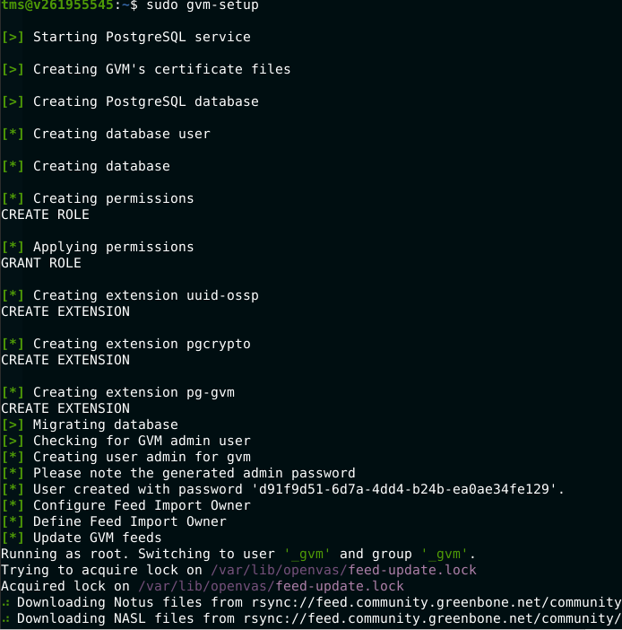
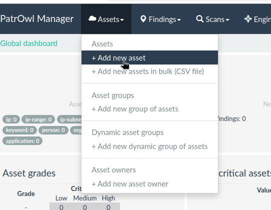
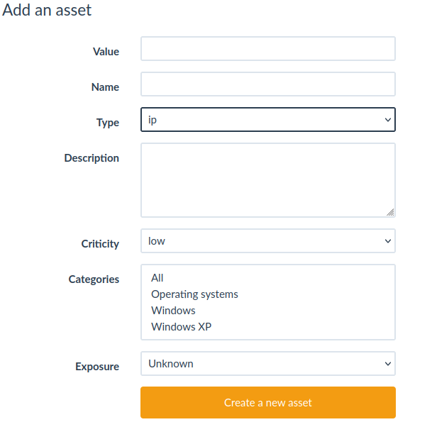
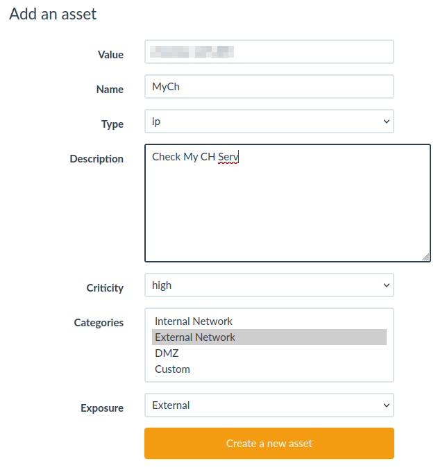
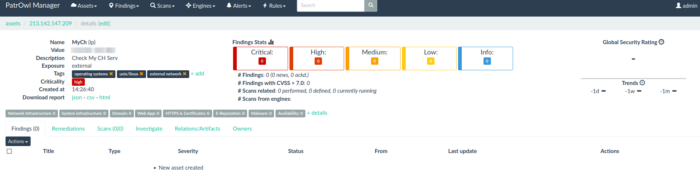
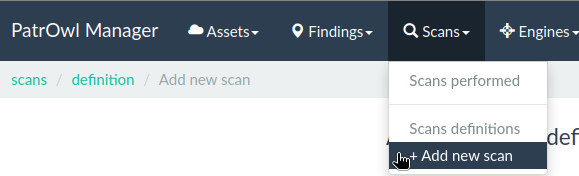
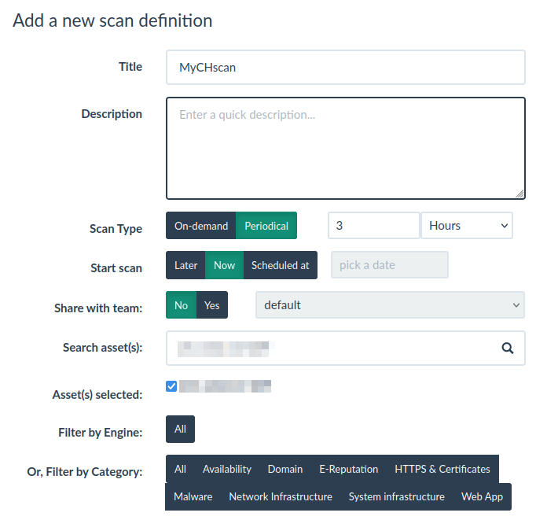

# Домашняя работа № 22
### Vulnerability Assessment
*VA, Patch management, этапы VA, vulnerability scanners*

---

## Задачи:

1. **Scanner OpenVAS**
    - Установить сканер уязвимостей OpenVAS.
    - Просканировать VM.
    - Из отчёта выбрать CVE и на различных ресурсах найти решение по устранению уязвимости.

<details>
  <summary> Выполнение </summary>

Ещё в процессе (веб-интерфейс не работает, белая страница)
  
1. Установка, настройка и запуск Greenbone Vulnerability Manager

```bash
tms@v261955545:~$ sudo apt update && sudo apt upgrade -y
Hit:1 http://cdn.archive.ubuntu.com/ubuntu noble InRelease
Get:2 http://cdn.archive.ubuntu.com/ubuntu noble-updates InRelease [126 kB]
Get:3 http://cdn.archive.ubuntu.com/ubuntu noble-backports InRelease [126 kB]         
Get:4 http://security.ubuntu.com/ubuntu noble-security InRelease [126 kB]             
Get:5 http://cdn.archive.ubuntu.com/ubuntu noble-updates/main amd64 Components [131 kB]
Get:6 http://cdn.archive.ubuntu.com/ubuntu noble-updates/restricted amd64 Components [212 B]
Get:7 http://cdn.archive.ubuntu.com/ubuntu noble-updates/universe amd64 Components [309 kB]         
Get:8 http://cdn.archive.ubuntu.com/ubuntu noble-updates/multiverse amd64 Components [940 B]              
Get:9 http://cdn.archive.ubuntu.com/ubuntu noble-backports/main amd64 Components [208 B]                
Get:10 http://cdn.archive.ubuntu.com/ubuntu noble-backports/restricted amd64 Components [212 B]         
Get:11 http://cdn.archive.ubuntu.com/ubuntu noble-backports/universe amd64 Components [11.7 kB]
Get:12 http://cdn.archive.ubuntu.com/ubuntu noble-backports/multiverse amd64 Components [212 B]
Get:13 http://security.ubuntu.com/ubuntu noble-security/main amd64 Components [7,184 B] 
Get:14 http://security.ubuntu.com/ubuntu noble-security/restricted amd64 Components [208 B]
Get:15 http://security.ubuntu.com/ubuntu noble-security/universe amd64 Components [51.8 kB]
Get:16 http://security.ubuntu.com/ubuntu noble-security/multiverse amd64 Components [208 B]
Fetched 892 kB in 1s (1,302 kB/s)   
Reading package lists... Done
Building dependency tree... Done
Reading state information... Done
tms@v261955545:~$ sudo apt install gvm -y
...trimmed...
sudo gvm-setup

```



По завершению будет сказан пароль от admin

Проверим статус:

```
tms@v261955545:~$ systemctl status gvmd
● gvmd.service - Greenbone Vulnerability Manager daemon (gvmd)
     Loaded: loaded (/usr/lib/systemd/system/gvmd.service; enabled; preset: enabled)
     Active: active (running) since Sat 2024-11-30 09:21:50 UTC; 1h 10min ago
       Docs: man:gvmd(8)
    Process: 118757 ExecStart=/usr/sbin/gvmd --osp-vt-update=/run/ospd/ospd.sock --listen-group=_gvm (code=exited, status=0/SUCCESS)
   Main PID: 118758 (gvmd)
      Tasks: 2 (limit: 4611)
     Memory: 95.3M (peak: 2.6G)
        CPU: 6min 14.208s
     CGroup: /system.slice/gvmd.service
             ├─118758 "gvmd: Waiting " --osp-vt-update=/run/ospd/ospd.sock --listen-group=_gvm
             └─118779 gpg-agent --homedir /var/lib/gvm/gvmd/gnupg --use-standard-socket --daemon
tms@v261955545:~$ 
tms@v261955545:~$ sudo netstat -tulpan | grep gsad
tcp        0      0 127.0.0.1:9392          0.0.0.0:*               LISTEN      118753/gsad         
```

Пустим gvm вовне и Изменим порт со стандартного 9293 на другой в `/lib/systemd/system/gsad.service`

Строка будет выглядеть так:

`ExecStart=/usr/sbin/gsad --foreground --listen 0.0.0.0 --port 4288`

Применим изменения и проверим:

```
tms@v261955545:~$ sudo systemctl daemon-reload
tms@v261955545:~$ sudo systemctl restart gsad
tms@v261955545:~$ sudo netstat -tulpan | grep gsad
tcp        0      0 0.0.0.0:4288            0.0.0.0:*               LISTEN      121158/gsad    
```

Установим веб-приложение для gsa и настроим веб (сборка веб-проекта довольно длительная):

```bash
tms@v261955545:~$ sudo apt update
tms@v261955545:~$ sudo apt install -y nodejs npm
...trimmed...
tms@v261955545:~$ sudo git clone https://github.com/greenbone/gsa /usr/share/gvm/gsad/web
Cloning into '/usr/share/gvm/gsad/web'...
remote: Enumerating objects: 206213, done.
remote: Counting objects: 100% (9241/9241), done.
remote: Compressing objects: 100% (3277/3277), done.
remote: Total 206213 (delta 6543), reused 8139 (delta 5870), pack-reused 196972 (from 1)
Receiving objects: 100% (206213/206213), 72.85 MiB | 24.41 MiB/s, done.
Resolving deltas: 100% (165366/165366), done.
tms@v261955545:/usr/share/gvm/gsad/web$ sudo npm run build

> gsa@24.0.2-dev1 build
> vite build

vite v5.4.11 building for production...
<script src="/config.js"> in "/index.html" can't be bundled without type="module" attribute
✓ 4906 modules transformed.

build/assets/browser-ponyfill-legacy-tqB_Y0bq.js     13.60 kB │ gzip:   4.16 kB
build/assets/polyfills-legacy-DJpwfC8g.js           154.47 kB │ gzip:  61.01 kB
build/assets/opensight-ui-legacy-BZBMWwFO.js      1,272.37 kB │ gzip: 275.76 kB
build/assets/index-legacy-CNBAgqdf.js             4,960.59 kB │ gzip: 947.13 kB

(!) Some chunks are larger than 500 kB after minification. Consider:
- Using dynamic import() to code-split the application
- Use build.rollupOptions.output.manualChunks to improve chunking: https://rollupjs.org/configuration-options/#output-manualchunks
- Adjust chunk size limit for this warning via build.chunkSizeWarningLimit.
build/index.html                               2.53 kB │ gzip:   1.09 kB
build/assets/roboto-400-CEBEUyyq.woff         20.34 kB
build/assets/roboto-500-j0ba7u44.woff         20.54 kB
build/assets/greenbone-QpulX5H-.svg           20.82 kB │ gzip:   3.08 kB
build/assets/opensight-ui-C6wML3ZX.css       264.27 kB │ gzip:  36.83 kB
build/assets/browser-ponyfill-Bsq5jgNG.js     13.16 kB │ gzip:   4.02 kB
build/assets/opensight-ui-BM_mNMux.js        873.12 kB │ gzip: 210.61 kB
build/assets/index-Diblf03U.js             4,466.11 kB │ gzip: 846.94 kB

(!) Some chunks are larger than 500 kB after minification. Consider:
- Using dynamic import() to code-split the application
- Use build.rollupOptions.output.manualChunks to improve chunking: https://rollupjs.org/configuration-options/#output-manualchunks
- Adjust chunk size limit for this warning via build.chunkSizeWarningLimit.
✓ built in 6m 3s
tms@v261955545:/usr/share/gvm/gsad/web$ sudo chown -R _gvm:_gvm /usr/share/gvm/gsad/web/build/
tms@v261955545:/usr/share/gvm/gsad/web$ sudo chmod -R 755 /usr/share/gvm/gsad/web/build/
tms@v261955545:/usr/share/gvm/gsad/web$ sudo cp -r /usr/share/gvm/gsad/web/build/* /usr/share/gvm/gsad/web/
```


</details>

2. **Зарегистрироваться на opencve.io**
    - Подписаться на отслеживание релевантных для вас уязвимостей (Linux, Windows, сетевое оборудование и т.д.).

<details>
  <summary> Выполнение </summary>
 
Зарегистрировалась, подтвердила регистрацию.

Для бесплатного использования там можно только на 1 проект подписаться. Меня интересовали `Malware-Tracking` и `Linux-Security`.

Подписалась на `Linux-Security`.


Уведомлять будут на email


</details>

3. **Установить PatrOwl**
    - Добавить несколько активов, рассмотреть функционал решения.

<details>
  <summary> Выполнение </summary>
  
PatrOwl — это открытая, масштабируемая платформа для оркестрации операций безопасности.

Она позволяет управлять активами, проводить сканирование на уязвимости и интегрироваться с различными инструментами безопасности.

Для установки PatrOwl рекомендуется использовать Docker, что упрощает процесс развертывания.

1. Установка и настройка

```
sudo apt update
sudo apt install docker.io docker-compose -y
sudo systemctl start docker
sudo systemctl enable docker
git clone https://github.com/Patrowl/PatrowlManager.git
```

PatrOwl по умолчанию слушает localhost, но его можно настроить на прослушивание всех интерфейсов (0.0.0.0), чтобы он стал доступен извне.

```
cd PatrowlManager
sudo sed -i '/patrowlmanager-nginx:/,/image:/ { /ports:/!b;n;/8000:/!s/.*/      - "8000:8000"/ }' docker-compose.yml
sudo sed -i '/patrowlmanager-nginx:/,/image:/ { /environment:/!b;n;a\      - ALLOWED_HOSTS=*\n      - DEBUG=False' docker-compose.yml
tms@v261955545:~/PatrowlManager$ sudo docker-compose up -d
Creating network "patrowlmanager_default" with the default driver
Pulling rabbitmq (rabbitmq:3-alpine)...
3-alpine: Pulling from library/rabbitmq
da9db072f522: Pull complete
47419f9fac06: Pull complete
35bccdea0b9e: Pull complete
03bbfa77339f: Pull complete
f4db65b846a3: Pull complete
42203f15e8af: Pull complete
74659fecdd41: Pull complete
ad5455b21658: Pull complete
a5087fe80f83: Pull complete
Digest: sha256:ffd84cbb6f39fdd8a12d4634c9bfc45506b693d528ad826d9675cd0e78a20f2c
Status: Downloaded newer image for rabbitmq:3-alpine
Pulling db (postgres:11-alpine)...
11-alpine: Pulling from library/postgres
661ff4d9561e: Pull complete
78d5f75d0d36: Pull complete
6a6e46f43853: Pull complete
461502dc2d2f: Pull complete
3143a11ba1b8: Pull complete
9ea4ef0bd3f1: Pull complete
7637f1518faa: Pull complete
8b4c3c3e77d6: Pull complete
Digest: sha256:ea50b9fd617b66c9135816a4536cf6e0697d4eea7014a7194479c95f6edd5ef9
Status: Downloaded newer image for postgres:11-alpine
Building web
DEPRECATED: The legacy builder is deprecated and will be removed in a future release.
            Install the buildx component to build images with BuildKit:
            https://docs.docker.com/go/buildx/

Sending build context to Docker daemon  8.042MB
Step 1/18 : FROM python:3.7-slim
3.7-slim: Pulling from library/python
a803e7c4b030: Pull complete 
bf3336e84c8e: Pull complete 
8973eb85275f: Pull complete 
f9afc3cc0135: Pull complete 
39312d8b4ab7: Pull complete 
Digest: sha256:b53f496ca43e5af6994f8e316cf03af31050bf7944e0e4a308ad86c001cf028b
Status: Downloaded newer image for python:3.7-slim
 ---> a255ffcb469f
Step 2/18 : MAINTAINER Patrowl.io "getsupport@patrowl.io"
 ---> Running in fa793ec039dd
 ---> Removed intermediate container fa793ec039dd
 ---> 36ffce3f37c1
....TRIMMED....
Step 16/18 : EXPOSE 8003
 ---> Running in 8b2b7ad23927
 ---> Removed intermediate container 8b2b7ad23927
 ---> 51a6593e39a0
Step 17/18 : ENTRYPOINT ["/opt/patrowl-manager/docker-entrypoint.sh"]
 ---> Running in edf5493ff1d2
 ---> Removed intermediate container edf5493ff1d2
 ---> bccda0f004bf
Step 18/18 : CMD ["run"]
 ---> Running in 4ca85f07566b
 ---> Removed intermediate container 4ca85f07566b
 ---> 3e9053470ae3
Successfully built 3e9053470ae3
Successfully tagged patrowl/patrowl-manager-community-edition:latest
WARNING: Image for service web was built because it did not already exist. To rebuild this image you must use `docker-compose build` or `docker-compose up --build`.
Pulling nginx (nginx:stable-alpine)...
stable-alpine: Pulling from library/nginx
da9db072f522: Already exists
068b4536fb82: Pull complete
9301b75a59e7: Pull complete
f69e73dd210e: Pull complete
6715a1066dac: Pull complete
a19f1e837fdf: Pull complete
ede6cd11b305: Pull complete
10e76302afc6: Pull complete
Digest: sha256:d6f8c6b38edf2b7c6619718ad7a00caa4ed4741d12ce12550333a28d2b52dc89
Status: Downloaded newer image for nginx:stable-alpine
Creating patrowlmanager-postgres ... done
Creating patrowlmanager-rabbitmq ... done
Creating patrowlmanager-django   ... done
Creating patrowlmanager-nginx    ... done
```

Теперь можно заходить по URL `http://<IP>:8083`

Креды по умолчанию: `admin/Bonjour1!`

Чтобы сменить пароль, сначала сгенерируем его хэш с помощью python (на любой машине):

```
root@v261955545:~# apt install python3-django
Reading package lists... Done
Building dependency tree... Done
Reading state information... Done
The following package was automatically installed and is no longer required:
  libyara10
Use 'apt autoremove' to remove it.
The following additional packages will be installed:
  python3-sqlparse
Suggested packages:
  bpython3 geoip-database-contrib gettext ipython3 libgdal20 libsqlite3-mod-spatialite python-django-doc python3-flup python3-memcache python3-mysqldb python3-pil python3-psycopg2 python3-selenium
  python3-sqlite python-sqlparse-doc
The following NEW packages will be installed:
  python3-django python3-sqlparse
0 upgraded, 2 newly installed, 0 to remove and 2 not upgraded.
Need to get 2,952 kB of archives.
After this operation, 25.9 MB of additional disk space will be used.
Do you want to continue? [Y/n] 
Get:1 http://cdn.archive.ubuntu.com/ubuntu noble-updates/main amd64 python3-sqlparse all 0.4.4-1ubuntu0.1 [31.8 kB]
Get:2 http://cdn.archive.ubuntu.com/ubuntu noble-updates/main amd64 python3-django all 3:4.2.11-1ubuntu1.3 [2,920 kB]
Fetched 2,952 kB in 1s (2,677 kB/s)         
Selecting previously unselected package python3-sqlparse.
(Reading database ... 224166 files and directories currently installed.)
Preparing to unpack .../python3-sqlparse_0.4.4-1ubuntu0.1_all.deb ...
Unpacking python3-sqlparse (0.4.4-1ubuntu0.1) ...
Selecting previously unselected package python3-django.
Preparing to unpack .../python3-django_3%3a4.2.11-1ubuntu1.3_all.deb ...
Unpacking python3-django (3:4.2.11-1ubuntu1.3) ...
Setting up python3-sqlparse (0.4.4-1ubuntu0.1) ...
Setting up python3-django (3:4.2.11-1ubuntu1.3) ...
Processing triggers for man-db (2.12.0-4build2) ...
Scanning processes...                                                                                                                                                                                              
Scanning candidates...                                                                                                                                                                                             
Scanning linux images...                                                                                                                                                                                           

Pending kernel upgrade!
Running kernel version:
  6.8.0-44-generic
Diagnostics:
  The currently running kernel version is not the expected kernel version 6.8.0-49-generic.

Restarting the system to load the new kernel will not be handled automatically, so you should consider rebooting.

Restarting services...

Service restarts being deferred:
 /etc/needrestart/restart.d/dbus.service
 systemctl restart systemd-logind.service
 systemctl restart unattended-upgrades.service

No containers need to be restarted.

No user sessions are running outdated binaries.

No VM guests are running outdated hypervisor (qemu) binaries on this host.

root@v261955545:~# python3
Python 3.12.3 (main, Nov  6 2024, 18:32:19) [GCC 13.2.0] on linux
Type "help", "copyright", "credits" or "license" for more information.
>>> from django.conf import settings
>>> from django.contrib.auth.hashers import make_password
>>> settings.configure(
...     PASSWORD_HASHERS=[
...         'django.contrib.auth.hashers.PBKDF2PasswordHasher',
...     ]
... )
>>> password_hash = make_password("YOUR_PASSWORD_HERE")

>>> print(password_hash)
pbkdf2_sha256$600000$SOYBkep78I9xRzKuI1rkta$+KIxviRNAX0W8THI8x3VN/no1awle1NdVlqUUYd15WA=
```

Далее изменим пароль с помощью pgsql в контейнере, предварительно узнав имя базы и пользователя в docker-compose.yml

```
tms@v261955545:~/PatrowlManager$ sudo docker exec -it patrowlmanager-django bash
root@0484bd8d6e6a:/opt/patrowl-manager# source /opt/patrowl-manager/.venv/bin/activate
bash: /opt/patrowl-manager/.venv/bin/activate: No such file or directory
root@0484bd8d6e6a:/opt/patrowl-manager# 
exit
tms@v261955545:~/PatrowlManager$ sudo docker exec -it patrowlmanager-postgres bash
b5ca551b309d:/# psql -U PATROWL_DB_USER -d patrowl_db
psql (11.22)
Type "help" for help.

patrowl_db=# UPDATE auth_user SET password = 'pbkdf2_sha256$600000$SOYBkep78I9xRzKuI1rkta$+KIxviRNAX0W8THI8x3VN/no1awle1NdVlqUUYd15WA=' WHERE username = 'admin';
UPDATE 1
patrowl_db=# \q
```

Всё, проверить можно, сделав Logout из веб-интерфейса и зайдя с новым паролем.

2. Добавление активов

Делается в `Assets`



Коректное заполнение Asset (актива) в PatrOwl важно для правильной работы инструмента.

Актив — это объект, который ты хочешь отслеживать и анализировать на уязвимости. Это может быть сервер, домен, IP-адрес или даже программное обеспечение.



#### **1. Value (Значение)**
- **Описание:** Здесь вводится конкретное значение актива, например, IP-адрес, домен, диапазон IP-адресов или имя хоста.
- **Примеры:**
  - Для IP-адреса: `192.168.1.10`
  - Для домена: `example.com`
  - Для диапазона: `192.168.1.0/24`
  - Для хоста: `webserver.local`

---

#### **2. Name (Название)**
- **Описание:** Уникальное название для актива. Помогает идентифицировать актив в списке. 
- **Примеры:**
  - `Corporate Web Server`
  - `DNS Server`
  - `Public Network`

---

#### **3. Type (Тип)**
- **Описание:** Тип актива, который ты добавляешь. Выбор из выпадающего списка. Это определяет, как система будет обрабатывать актив.
- **Варианты:**
  - **IP:** Для одиночного IP-адреса (`192.168.1.10`).
  - **CIDR Range:** Для диапазона адресов (`192.168.1.0/24`).
  - **Domain:** Для домена (`example.com`).
  - **Hostname:** Для имени хоста (`webserver.local`).
- **Пример выбора:**
  - Если добавляешь `192.168.1.10`, выбери `IP`.
  - Если это диапазон `192.168.1.0/24`, выбери `CIDR Range`.

---

#### **4. Description (Описание)**
- **Описание:** Поле для заметок или пояснений об активе.
- **Примеры:**
  - "Основной веб-сервер компании, критически важный для работы."
  - "Диапазон IP-адресов, используемый в офисной сети."
  - "Публичный DNS-сервер."

---

#### **5. Criticity (Критичность)**
- **Описание:** Уровень важности актива для бизнеса. Помогает определить приоритет при анализе уязвимостей.
- **Варианты:**
  - `Low` (Низкий) — Для незначительных активов, тестовой среды.
  - `Medium` (Средний) — Для серверов с важными функциями.
  - `High` (Высокий) — Для ключевых активов, без которых бизнес не работает.
  - `Critical` (Критический) — Для серверов и систем, выход из строя которых вызовет катастрофические последствия.
- **Примеры:**
  - Для публичного веб-сервера: `Critical`.
  - Для тестового окружения: `Low`.

---

#### **6. Categories (Категории)**
- **Описание:** Категории или группы, к которым относится актив. Это помогает фильтровать и группировать активы.
- **Варианты:**
  - `All`: Все категории.
  - `Operating systems`: Операционные системы.
  - `Windows`: Активы на базе Windows.
  - `Windows XP`: Конкретная версия Windows.
- **Примеры:**
  - Для Linux-сервера выбери: `Operating systems`.
  - Для компьютера с Windows XP: `Windows XP`.

---

#### **7. Exposure (Подверженность)**
- **Описание:** Указывает, насколько актив подвергается внешним угрозам. Влияет на приоритет проверки.
- **Варианты:**
  - `Unknown`: Подверженность неизвестна.
  - `Internal`: Актив доступен только внутри сети.
  - `External`: Актив доступен из интернета.
- **Примеры:**
  - Для внутреннего сервера базы данных: `Internal`.
  - Для публичного веб-сервера: `External`.

---

### **Пример заполнения актива**

#### Пример 1: Веб-сервер
- **Value:** `example.com`
- **Name:** `Corporate Web Server`
- **Type:** `Domain`
- **Description:** "Публичный веб-сайт компании."
- **Criticity:** `Critical`
- **Categories:** `Operating systems`
- **Exposure:** `External`

#### Пример 2: Внутренний сервер
- **Value:** `192.168.1.10`
- **Name:** `Database Server`
- **Type:** `IP`
- **Description:** "Сервер базы данных для внутренней сети."
- **Criticity:** `High`
- **Categories:** `Operating systems`
- **Exposure:** `Internal`


Вот мой пример:





3. Задания на сканирование





Не сохраняется... Пытаюсь понять, почему. Нет ни кнопки ОК/Save, ничего.


</details>

---

## Дополнительные ресурсы:

- [NVD](https://nvd.nist.gov)
- [opencve.io](https://www.opencve.io/welcome)
- [vulners.com](https://vulners.com/)
- [OTX AlienVault](https://otx.alienvault.com/)
- [OpenVAS видео](https://www.youtube.com/watch?v=egiJ9A7oq3U)
- [PatrOwl установка](https://github.com/Patrowl/PatrowlDocs/blob/master/installation/installation-guide.md)
- [Greenbone VM](https://www.greenbone.net/en/greenbone-free/#toggle-id-1)
