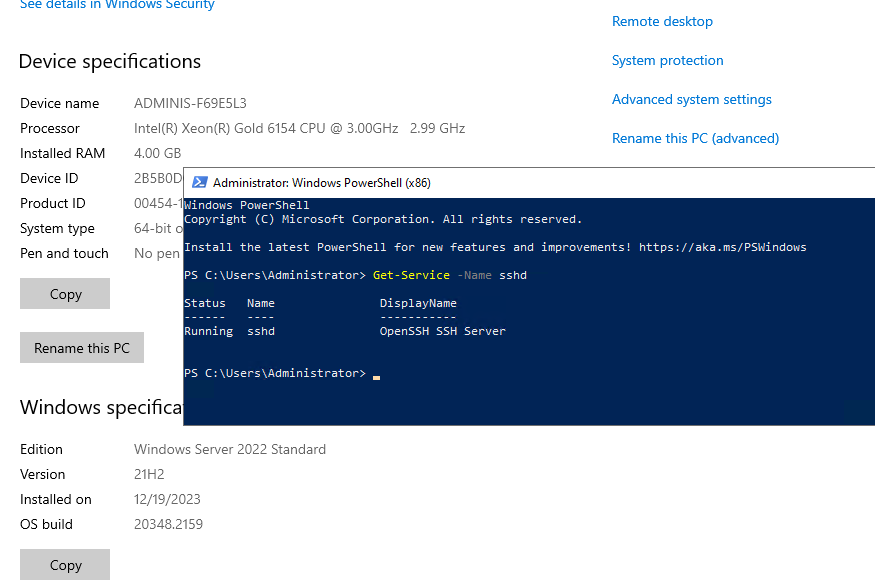

- RDP на виндовых VPS уже итак включен по умолчанию, поэтому не понадобилось включать его. 
Включила ssh-сервер на VPS с Windows Server 2022

- включила ssh-сервер на VPS с Windows 10 pro, дополнительно ограничив порт, разрешив подключение только с IP VPS с Windows Server 2022

- изменила правила блокировок учёток при неудачных попытках (7 раз - бан 5 минут)

- просканировала nmap'ом виндовые впс 
На Win 10 дополнительно ещё был ограничен 22 порт (доступен только для IP VPS с Windows Server 2022), это видно по filtered в результатах

- словарь для брута сделала совсем мизерный, чтобы было быстрее, т.к. здесь цель понять, как это вообще делается. 
Ну, и вместо root указала Administrator, мы же брутили винду, как-никак)) 
Естественно, с таким словарём гидра не добилась успеха)

