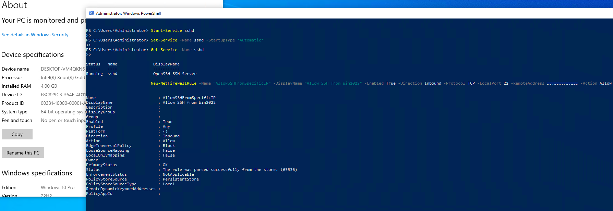
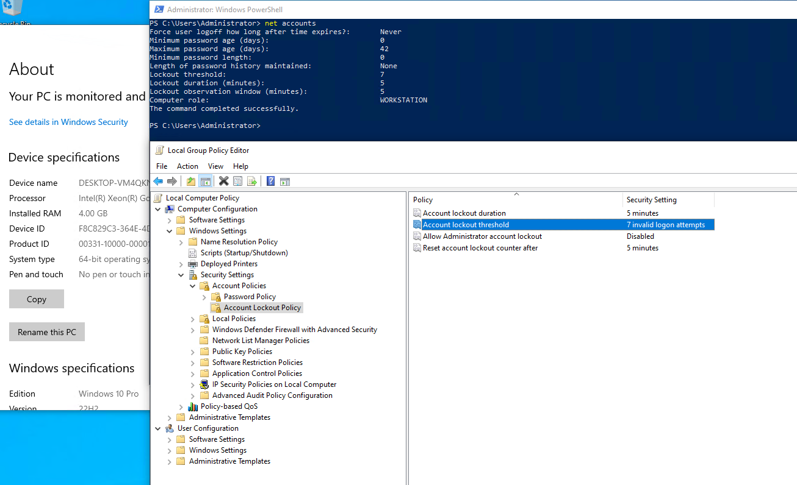
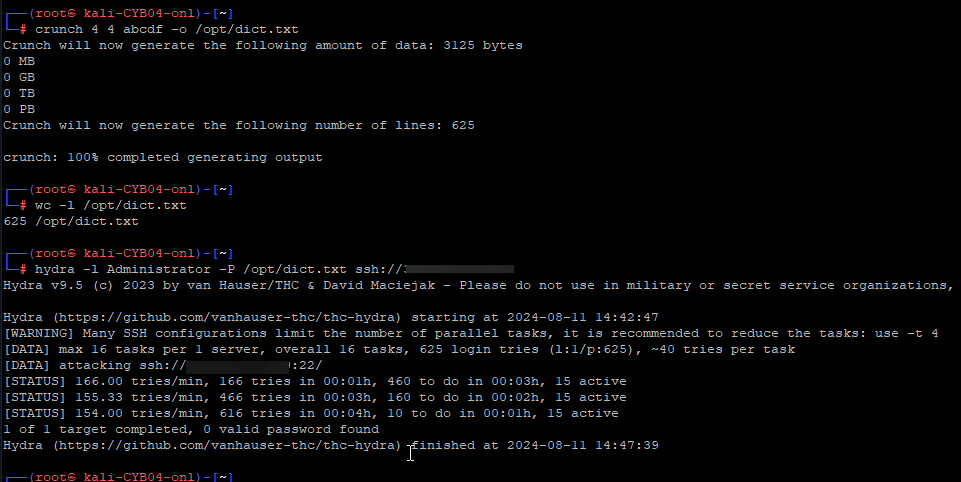

Урок 3
ДЗ

!(winserver_sshserv_enable.png)

просканировала nmap'ом виндовые впс
На Win 10 дополнительно ещё был ограничен 22 порт (доступен только для IP VPS с Windows Server 2022), это видно по filtered в результатах

словарь для брута сделала совсем мизерный, чтобы было быстрее. Ну, и вместо root указала Administrator, мы ж брутили винду))
Естественно, с таким словарём гидра не добилась успеха)
