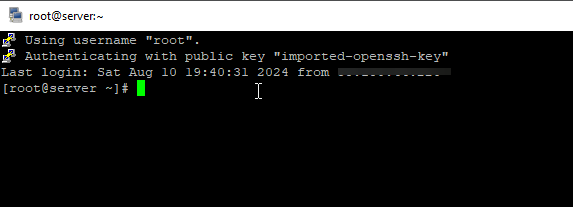
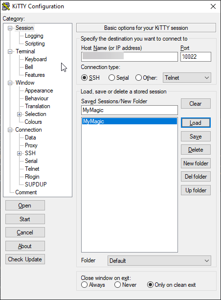
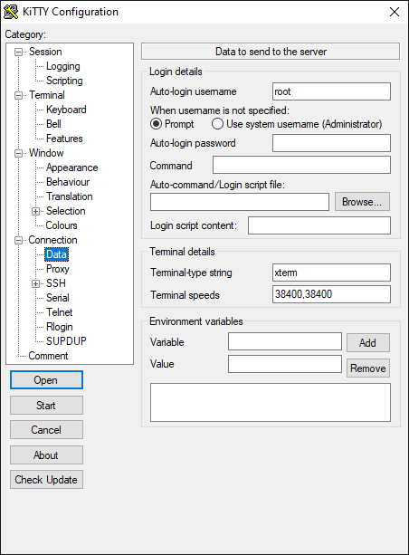
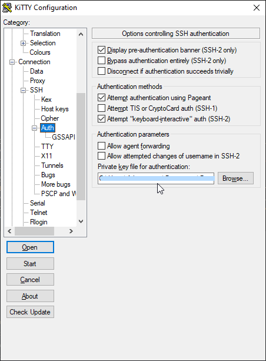
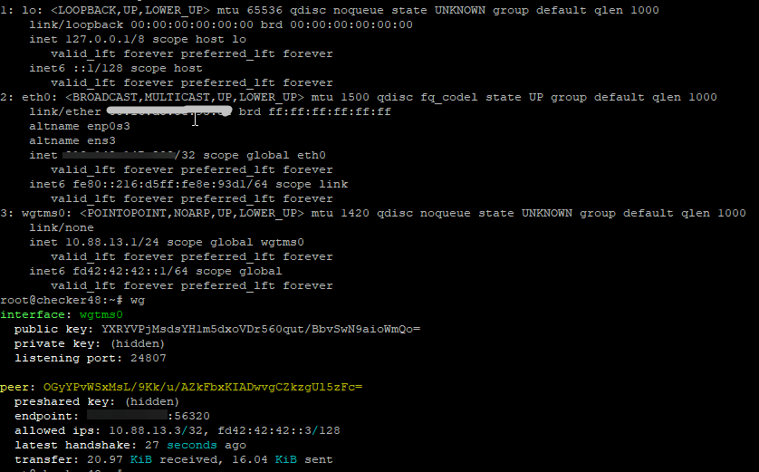
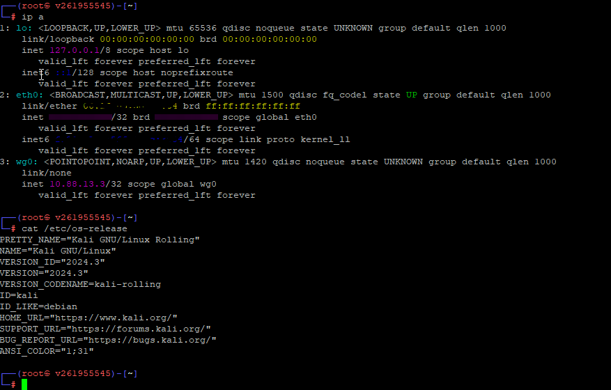
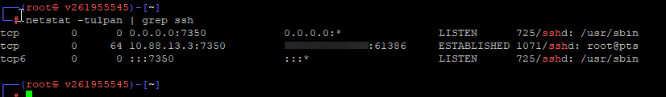

# Домашняя работа №6

## Криптография
_Диффи Хелман, SHA, DES, SSL, TLS, HTTP/HTTPS, Certs_

### 1. Изучить этапы, методы и протоколы IPSec фреймворка
    - IKE Phase 1
    - IKE Phase 2
    - IPSec framework protocols
    - HTTP vs HTTPS

#### _Очень кратко про IPsec:_

IPsec довольно сложный протокол и представляет собой набор протоколов, которые придумали, чтобы защитить трафик в сети через:
- _аутентификацию_ (гарантия того, что пакет пришёл именно от нужного отправителя - проверка заголовков) - используется предварительный общий ключ, усиливая группой протоколов DH (Diffie Hellman), или цифровые сертификаты
- _обеспечение целостности_ (гарантия того, что по пути пакет не менялся - проверка данных) - протоколы MD5 или SHA
- _конфиденциальности_ (собственно, через шифрование, чтобы никто более не смог прочесть пакет) - используются DES, 3DES или AES
- _анти-повтора_ (исключаются дубли пакетов, которые могут оказаться подменёнными).<br>

Работает поверх IP, на сетевом уровне. После инициирования IPsec создаёт туннель между двумя пирами (это P2P - Peer-to-peer протокол) в два этапа (фазы) за счёт протокола IKE (Internet Key Exchange). <br>
Уже из перевода понятно, что делает IKE - Интернет-обмен ключами.<br>
На первой фазе (IKE phase 1) пиры договариваются о Security Association (SA): это значит о том, какие протоколы будут использоваться для реализации функий IPsec и других параметрах, а также устанавливают между собой туннель ISAKMP (Internet Security Association and Key Management Protocol) только для того, чтобы безопасно перейти на вторую фазу (IKE phase 2).<br>
Вот когда туннели установлены, подключаются и протоколы, о которых пиры договорились - ESP (Encapsulating Security Payload) или AH (Authentication Header), происходит передача данных и завершение (туннель IPsec закрывается).

#### _Про HTTP И HTTPS:_

Главное отличие: веб-протокол HTTPS - это защищённый сертификатом траффик, здесь участвует протокол SSL/TLS. На самом деле не только веб, но и другие типы трафика сейчас защищаются сертификатами (например, тот же почтовый трафик, т.е. SMTP/POP3/IMAP протоколы).
    
### 2. SSH Best Practice:
    - На VM Uubuntu настроить SSH по лучшим практикам
    - Сгенерировать на Windows host либо Kali linux VM (ssh-keygen) приватный и публичный ключ,
        добавить ключ (замок) ssh-add либо scp на ubuntu VM где настроили ssh
    - Подключиться к ubuntu VM используя приватный ключ

Лучшие практики на то и названы лучшими, что позволяют лучше обеспечить безопасность.<br>
Использовать актуальное ПО (старые дыры закрыты, новые ещё могут быть и не найдены) и убирать то, что не используется - эти два правила относятся не только к SSH, а, впрочем, ко всему ПО.<br>
#### _Про SSH_:<br>
Конфиг - ```/etc/ssh/sshd_config``` - всё настраивается там (прежде всего нужно бы сделать копию, мало ли чего).<br>
После изменения файла требуется перезагрузка службы<br>
```systemctl restart sshd```

_Те самые "лучше практики" для SSH:_<br>
- Указать версию протокола 2 - ```Protocol 2```
- Не держать SSH открытым для всех: сменить порт (```Port```) и ограничить его через фаерволл (iptables, например)
- Отключить авторизацию из файла .rhosts, по хосту и пустые пароли<br>
```IgnoreRhosts yes```<br>
```PermitEmptyPasswords no```<br>
```HostbasedAuthentication no```<br>
- Отключить авторизацию по паролю и настроить авторизацию по ключу<br>
```PasswordAuthentication no```<br>
```PubkeyAuthentication yes```<br>
```AuthorizedKeysFile      .ssh/authorized_keys .ssh/authorized_keys2```<br>

Я подключаюсь к своему серверу через PuTTY по ключу:

<br>
<br>
<br>
<br>
   

### 3. WireGuard VPN. *
    - Развернуть Ubuntu с двумя сетевыми интерфейсами.
        Один - в интернет, другой - во внутреннюю сеть, к которой у вас подключены WS и Kali.
        Настроить на ней возможность подключения по RDP и SSH c WS. Срок - неделя. 
    - Установить и настроить WireGuard VPN на Ubuntu
    - Установить агент VPN Wireguard на хостовую машину 
    - Установить VPN соединение между хостовой машиной и Ubuntu с VPN Wireguard  

Как я поняла задачу (на примере):<br>
- есть машина А с wireguard-сервером на интерфейсе wgtms0, её внешний IP, допустим, 223.12.47.29, ОС - Ubuntu<br>
Вот установленный WG на машине с Ubuntu:<br>
<br>
_Ставится легко скриптом_<br>
- есть машина Б с ssh на порту 7350 и IP-адресом 56.64.6.93, которая будет подключена к wireguard-серверу 223.12.47.29 на интерфейсе wg0 как 10.88.13.3, ОС - Kali

Нужно, чтобы после поднятия wireguard-интерфейса на машине Б ssh был доступен по адресу машины А, т.е. по 223.12.47.29 на порту 7350<br>
Логично это сделать, потому что при подключении к WG пропадает соединение к машине Б.

Как реализовать: на машине А пробросить порт 7350 на машину Б и разрещшить форвардинг.<br>
Т.е. подключаемся к 223.12.47.29, проверяем, чтобы в sysctl был включён форвардинг:<br>
```sysctl -a | grep -w net.ipv4.ip_forward```<br>
если равно 1, то включено, если 0, то включаем:<br>
```echo ""net.ipv4.ip_forward=1 >> /etc/sysctl.conf && sysctl -p```<br>
Дальше добавляем правила в iptables:<br>
```iptables -t nat -A PREROUTING -d 223.12.47.29 -p tcp --dport 7350 -j DNAT --to-destination 10.88.13.3:7350```<br>
это правило будет перенаправлять трафик с внешнего IP-адреса машины А (223.12.47.29) на порт 7350 к внутреннему IP-адресу WireGuard клиента на машине Б (10.88.13.3) на тот же порт.
```iptables -A FORWARD -p tcp -d 10.88.13.3 --dport 7350 -j ACCEPT```<br>
это нужно, чтобы разрешить форвардинг трафика между интерфейсами<br>

Готово, я смогла подключиться к 223.12.47.29:7350 и попасть на сервер 56.64.6.93 (Б)

<br>


Все IP-адреса вымышленные, любые совпадения совершенно случайны :)

Ссылки на дополнительные ресурсы:<br>
      [Что такое IPSec и как это работает](https://networklessons.com/cisco/ccie-routing-switching/ipsec-internet-protocol-security)<br>
      [Лучшие практики по настройке SSH](https://wiki.merionet.ru/articles/luchshie-praktiki-po-zashhite-ssh-podklyucheniya)<br>
      [Установка и конфиграция Wireguard VPN Ubuntu](https://habr.com/ru/sandbox/189100/)<br>
      [Отличие и безопаность HTTP vs HTTPS](https://www.cloudflare.com/learning/ssl/why-is-http-not-secure/#:~:text=The%20only%20difference%20between%20the,far%20more%20secure%20than%20HTTP.)<br>
