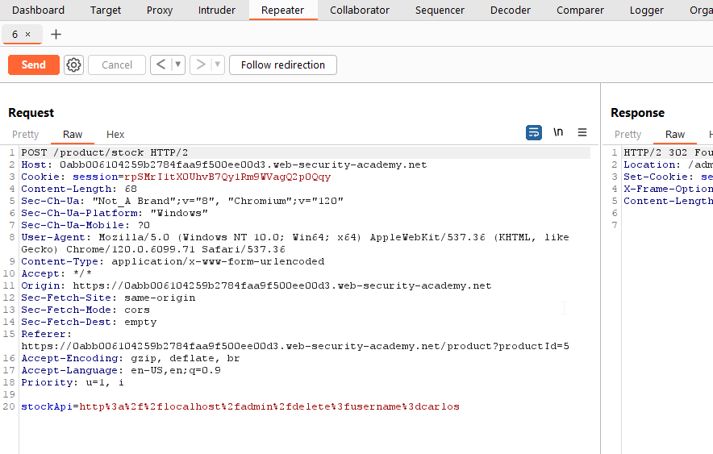
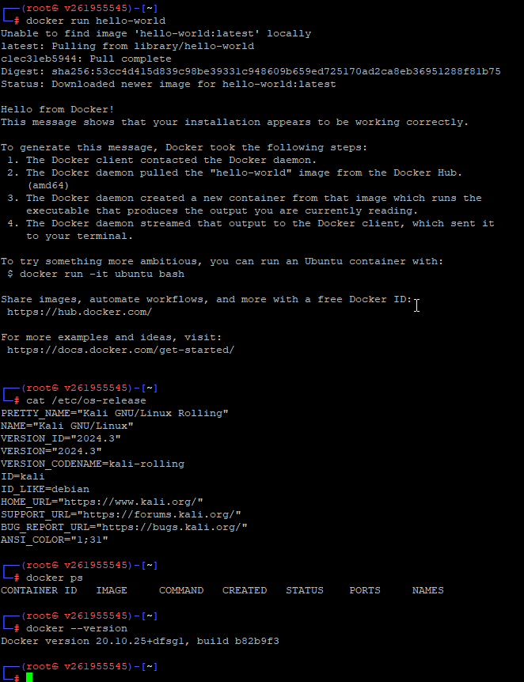

# Домашняя работа №7

## Типы атак I, OWASP top 10
_CVE, CWE, CAPEC, Injection, SQL_

### 1. Изучить SQL запросы.
- Пройти как можно больше заданий в SQLBOLT

Пока остановилась на 7 лабе, и то она мне туго далась уже: 

### 2. Лабораторные работы по OWASP TOP 10.
- Выполнить 2 лабораторные работы из практики Brocken Access Control 
  - Lab Broken Access Controll 1 
 
 
 
  - Lab Broken Access Controll 2 
 
- Выполнить 1 лабораторную работу из практики Injections 
  - Lab Injection 1 
 
- Выполнить 1 лабораторную работу из практики Server-Side Request Forgery 
  - Lab SSRF 1 
  
  

Вот что в итоге в учётке отображается
  

### 3.  Тренировка поиска уязвимостей на примере OWASP Juice Shop
 - OWASP Juice Shop

Docker поставила на машину с Kali, чтобы не плодить кучу VPS, вот есть [мануал](https://www.kali.org/docs/containers/installing-docker-on-kali/) 
  
 Контейнер с Juice Shop запустила, но заданий выполнила мало 
  
  
  
  

### Ссылки на дополнительные ресурсы
[Тренировка написания SQL запросов в SQLBOLT](https://sqlbolt.com) 
[Lab Broken Access Controll 1](https://portswigger.net/web-security/access-control/lab-user-role-controlled-by-request-parameter) 
[Lab Broken Access Controll_2](https://portswigger.net/web-security/access-control/lab-user-role-controlled-by-request-parameter) 
[Lab Injection 1](https://portswigger.net/web-security/sql-injection/lab-retrieve-hidden-data) 
[Lab SSRF 1](https://portswigger.net/web-security/ssrf/lab-basic-ssrf-against-localhost) 
[OWASP Juice Shop](https://spy-soft.net/owasp-juice-shop/) 
[Juice Shop Docker](https://hub.docker.com/r/bkimminich/juice-shop) 
