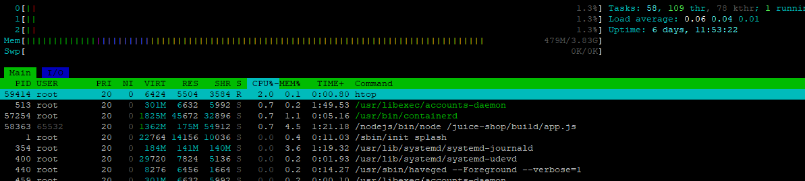
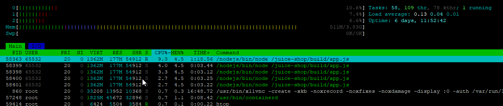

# Домашняя работа № 8
## Типы атак 2
_Spam, DDOS, botnet, MIM, Viruses_

### Провести DOS атаку на Juice Shop:
  - Запустить container juice shop и произвести dos
  - XerXes - Most powerful dos tool bY mR.Thg
  - Сделать скрин нагрузки на docker container 
вывод команды >top
<details open><summary>Выполнение:</summary>
Установила XerXes на машине с Linux (CentOS):<br>
  
```
mkdir /opt/tms-tools/
cd /opt/tms-tools/
wget "https://github.com/XCHADXFAQ77X/XERXES/archive/refs/heads/master.zip"
unzip master.zip
cd XERXES-master/
gcc -o xerxes xerxes.c
```
И запустила (в hosts у меня прописано соответствие домена juice-shop.tms IP-адресу машины, где живёт juice shop):

```
./xerxes juice-shop.tms 80
```

Нагрузки особой я не заметила, только в top'е на первое место вышел node.js. Вот до атаки:



Вот во время атаки:



</details>

```
#!/bin/bash
set -xe
sudo apt update -y
sudo apt install -y docker
sudo service docker start
sudo usermod -aG docker $USER
sudo docker pull bkimminich/juice-shop
sudo docker run -d -p 80:3000 bkimminich/juice-shop
```

### Изучить типы и средства spoofing’a лекции.

<details><summary>Материал:</summary>

# Что такое Spoofing?

_**Spoofing (спуфинг)**_ — это такой способ обмана, когда злоумышленник подделывает информацию, чтобы выдать себя за кого-то другого. Основная цель — заставить систему или пользователя поверить, что они взаимодействуют с чем-то или кем-то доверенным, хотя на самом деле это не так. Т.е., грубо говоря, "подмена личности", чтобы ввести в заблуждение с целью получения информации.

Спуфинг охватывает различные методы обмана, и защита от него требует как технических мер, так и внимательности со стороны пользователей. Регулярное обновление ПО, правильная настройка безопасности и внимательное отношение к подозрительным действиям помогут защитить себя и свою систему от атак.

## Основные виды спуфинга и меры защиты:
### IP Spoofing (Подмена IP-адреса):

_**Описание:**_ Злоумышленник может заставить систему думать, что подключение идёт с доверенного IP-адреса, хотя на самом деле это не так.
Обычно это делается для того, чтобы скрыть реальное местоположение атакующего, обойти ограничения по IP или провести DDoS-атаку.<br>
_**Защита:**_ Используйте межсетевые экраны (firewalls), чтобы блокировать подозрительные IP-адреса. Включите проверку исходного IP-адреса в сетевых устройствах.

### Email Spoofing (Подмена адреса электронной почты):

_**Описание:**_ Подменяется адрес отправителя в электронном письме, чтобы оно выглядело как отправленное от лица, которому вы доверяете.<br>
Такой подход часто используется для фишинга, когда жертва получает письмо, которое кажется официальным, и может передать свои данные или деньги, думая, что общается с реальной организацией.<br>
_**Защита:**_ Настройте SPF, DKIM и DMARC для своего домена, чтобы снизить риск подделки писем. Будьте внимательны к подозрительным письмам, особенно если не знаете отправителя.

### DNS Spoofing (Подмена DNS-запросов):

_**Описание:**_ Здесь подменяется ответ на DNS-запрос. Злоумышленник может перенаправить пользователя с законного сайта на свой собственный, вредоносный сайт.
Этим способом можно обманом получить доступ к данным пользователя или заразить его устройство вредоносным ПО.<br>
_**Защита:**_ Используйте DNSSEC для шифрования DNS-запросов и защищайте свои DNS-сервера от атак. Регулярно проверяйте и обновляйте свои DNS-настройки.

### ARP Spoofing (Подделка ARP-запросов):

_**Описание:**_ Подменяются запросы и ответы ARP, чтобы направить трафик на своё устройство.<br>
В результате злоумышленник может перехватить сетевой трафик, получить доступ к конфиденциальным данным или провести атаку типа "человек посередине".<br>
_**Защита:**_ Используйте фильтрацию MAC-адресов и статические ARP-записи, если это возможно. Применяйте инструменты мониторинга сети, чтобы выявлять подозрительную активность.

### Caller ID Spoofing (Подделка номера телефона):

_**Описание:**_ Подмена номера телефона, чтобы казаться звонком от доверенного источника.
Часто используется в мошеннических целях, когда, например, звонящий утверждает, что он представитель банка, чтобы выудить у вас личные данные.<br>
_**Защита:**_ Будьте осторожны при ответе на звонки с неизвестных номеров, особенно если звонящий просит передать конфиденциальную информацию. По возможности используйте сервисы, которые позволяют проверить подлинность номера.

</details>


### Ссылки на дополнительные ресурсы
 [XerXes - Most powerful dos tool bY mR.Thg](https://github.com/XCHADXFAQ77X/XERXES)
