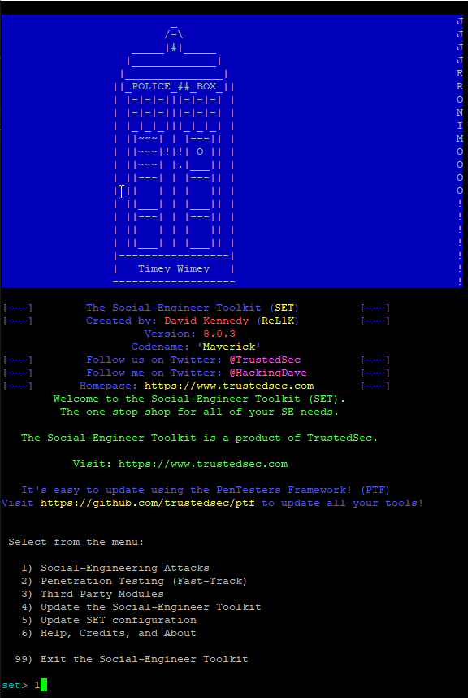
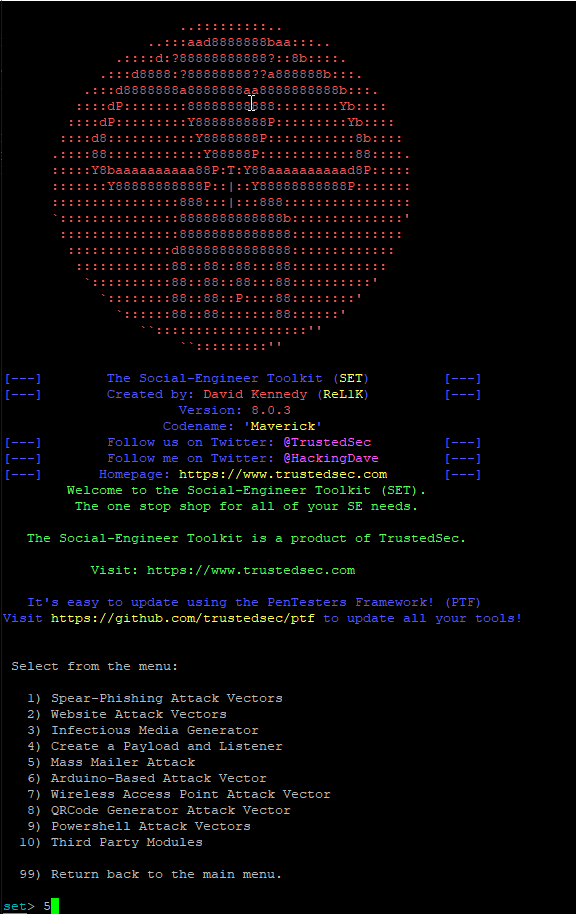
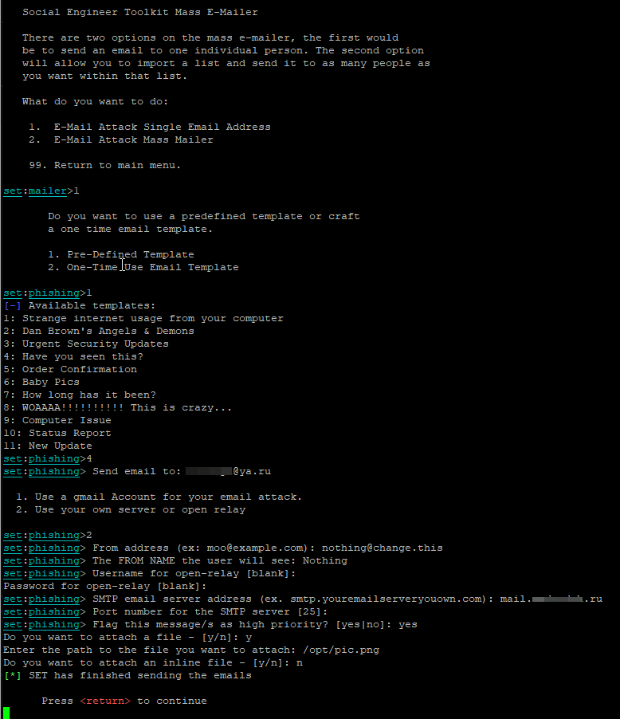
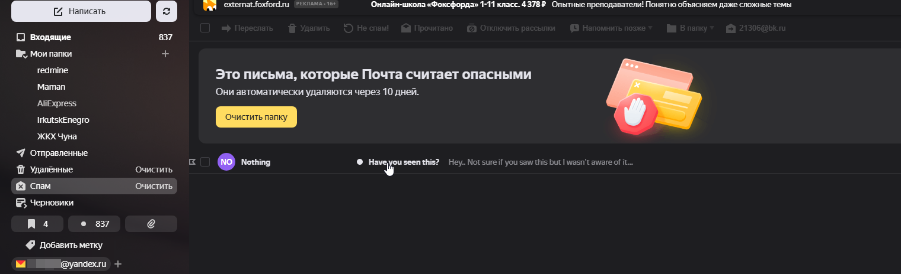
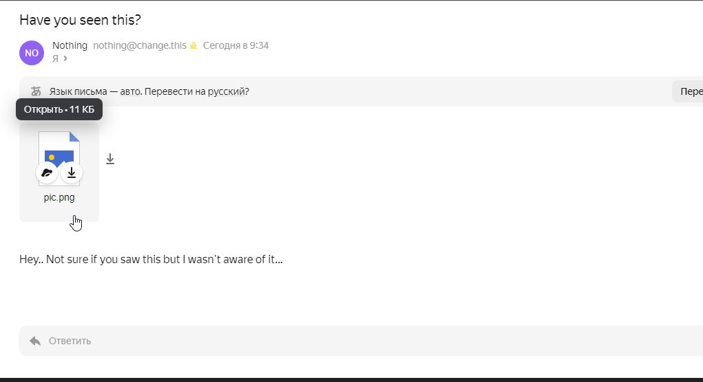
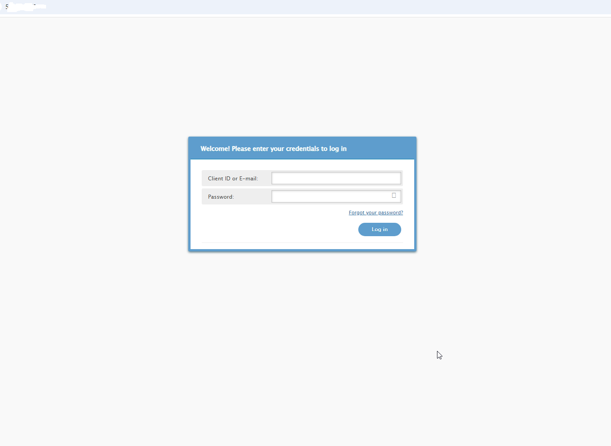
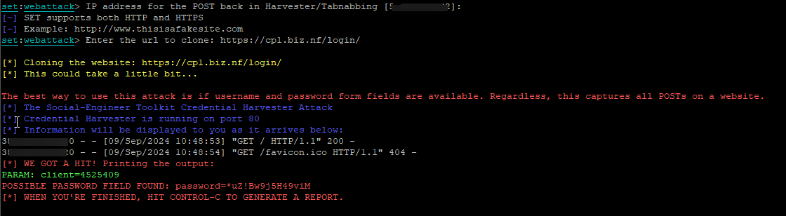

# Домашняя работа №9

## Социальная инженерия, фишинг
_Spam, Fishing, Social Engineering_

### Разослать фишинговое письмо с уникальной информацией, ведущее на копию крупного ресурса (соцсети, почты и т.д.)

<details><summary>- Установить setoolkit на Ubuntu VM</summary>
 <br>На Kali утилита уже имеется:
 
 

 </details>

<details><summary>- Сделать фишинговое письмо с копией распространенного сервиса</summary>
<br>Ну я просто сделала фишинговое письмо... Причём, мне проще было поднять SMTP-сервер на kali (exim4) для отправки письма.<br>
С ключами для Gmail возникли сложности.

 

 

 Вот запись в логе exim об успешной доставке письма:
 ```
2024-09-07 01:34:11 1smkL5-00000000e65-24eQ <= nothing@change.this H=(v261955545.local) [43.6.92.12] P=esmtps X=TLS1.3:ECDHE_X25519__RSA_PSS_RSAE_SHA256__AES_256_GCM:256 CV=no S=15813
2024-09-07 01:34:11 TLS error on connection from (v261955545.local) [43.6.92.12] (recv): The TLS connection was non-properly terminated.
2024-09-07 01:34:11 1smkL5-00000000e65-24eQ H=mx.yandex.ru [2a02:6b8::311] Network is unreachable
2024-09-07 01:34:12 1smkL5-00000000e65-24eQ H=mx.yandex.ru [77.88.21.249] TLS error on connection (recv): The TLS connection was non-properly terminated.
2024-09-07 01:34:12 1smkL5-00000000e65-24eQ => xxxxxxx@ya.ru R=dnslookup T=remote_smtp H=mx.yandex.ru [77.88.21.249] X=TLS1.3:ECDHE_SECP256R1__RSA_PSS_RSAE_SHA256__AES_256_GCM:256 CV=yes DN="C=RU,ST=Moscow,L=Moscow,O=YANDEX LLC,CN=mx.yandex.ru" C="250 2.0.0 Ok: queued on mail-nwsmtp-mxfront-production-main-42.sas.yp-c.yandex.net 1725672891-oYTsOiJLGSw0-m3DSxyvl"
2024-09-07 01:34:12 1smkL5-00000000e65-24eQ Completed
```
Вот скрины из ящика, куда отправлялось письмо:





Ну и технические заголовки полученного письма:
```
Received: from postback8b.mail.yandex.net (postback8b.mail.yandex.net [2a02:6b8:c02:900:1:45:d181:da08])
	by mail-notsolitesrv-production-main-24.iva.yp-c.yandex.net (notsolitesrv/Yandex) with LMTPS id guG0meqIpJoW-20VXYfBH
	for <xxxxxxx@ya.ru>; Sat, 07 Sep 2024 04:34:51 +0300
Received: from mail-nwsmtp-mxfront-production-main-42.sas.yp-c.yandex.net (mail-nwsmtp-mxfront-production-main-42.sas.yp-c.yandex.net [IPv6:2a02:6b8:c1c:3425:0:640:6940:0])
	by postback8b.mail.yandex.net (Yandex) with ESMTPS id C71C2608D7
	for <xxxxxxxx@ya.ru>; Sat,  7 Sep 2024 04:34:51 +0300 (MSK)
Received: from v261955545.local (unknown [43.6.92.12])
	by mail-nwsmtp-mxfront-production-main-42.sas.yp-c.yandex.net (mxfront/Yandex) with ESMTPS id oYTsOiJLGSw0-m3DSxyvl;
	Sat, 07 Sep 2024 04:34:51 +0300
X-Yandex-Fwd: 1
X-Yandex-Spam: 4
Received: from [43.6.92.12] (helo=v261955545.local)
	by v261955545.local with esmtps  (TLS1.3) tls TLS_ECDHE_RSA_WITH_AES_256_GCM_SHA384
	(Exim 4.98)
	(envelope-from <nothing@change.this>)
	id 1smkL5-00000000e65-24eQ
	for xxxxxxxx@ya.ru;
	Sat, 07 Sep 2024 01:34:11 +0000
Content-Type: multipart/mixed; boundary="===============6018959430144545376=="
MIME-Version: 1.0
From: =?utf-8?b?Tm90aGluZw==?= <nothing@change.this> 
To: xxxxxxx@ya.ru
X-Priority: 1 (Highest)
X-MSMail-Priority: High
Subject: =?utf-8?b?SGF2ZSB5b3Ugc2VlbiB0aGlzPw==?=
Message-Id: <E1smkL5-00000000e65-24eQ@v261955545.local>
Date: Sat, 07 Sep 2024 01:34:11 +0000
Return-Path: nothing@change.this
X-Yandex-Forward: 3103f67ac1db098e9fa5f059063dd9f7

--===============6018959430144545376==
MIME-Version: 1.0
Content-Type: text/plain; charset="utf-8"
Content-Transfer-Encoding: base64

SGV5Li4gTm90IHN1cmUgaWYgeW91IHNhdyB0aGlzIGJ1dCBJIHdhc24ndCBhd2FyZSBvZiBpdC4u
LiAKIAo=

--===============6018959430144545376==
Content-Type: application/
MIME-Version: 1.0
Content-Transfer-Encoding: base64
Content-Disposition: attachment; filename="pic.png"

iVBORw0KGgoAA-обрезано-lHfofTxeDffmT9J4AAAAASUVORK5CYII=

--===============6018959430144545376==--
```

</details>

<details><summary>- Сделать скрины сервиса и перехвата данных авторизации</summary>

Склонировала страницу входа [сюда](https://cp1.biz.nf/login/), домен не использовала, клон висел на IP-адресе:





</details>

<details><summary>- Сделать все это на виртуальной машине в облаке, с привязкой к реальному “поддельному” домену (*)</summary>

К сожалению, бесплатный домен так и не удалось раздобыть...

</details>

### Ссылки на дополнительные ресурсы
[Github repo setoolkit](https://github.com/trustedsec/social-engineer-toolkit)<br>
[Установка setoolkit на ubuntu](https://www.youtube.com/watch?v=y4sIesUADD8)
